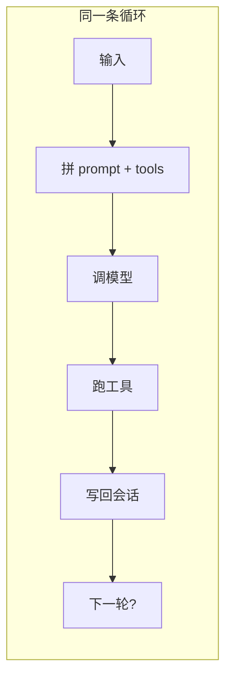
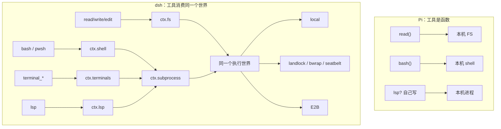

# DeepSeek Harness 与 Pi Agent 的架构分叉

两边解决的是同一个问题：coding agent 会不停长出 plan、subagent、审批、MCP、todo……你怎么让系统可变，又不把内核做成一坨。

答案几乎相反。

**Pi 的答案：内核极小，产品完整，扩展是用户的事。**
**dsh 的答案：没有特权内核，产品是插件叠出来的，扩展是系统本身。**

有个容易忽略的事实：dsh 的多模型适配器 `dsh-llm-pi-ai` 直接吃 `@earendil-works/pi-ai`。它们在「怎么跟一堆模型厂商说话」上是亲戚；在「agent 运行时怎么长」上是两条路。

## 先站在同一张图上

循环两边都有，长得也像：

```text
人的输入
  → 拼 system prompt + tools
  → 调模型
  → 跑工具
  → 把结果写回会话
  → 再决定要不要下一轮
```

分歧不在循环有没有，而在三件事：

1. 循环本身能不能换
2. 「工具 / 文件系统 / 子进程」是函数，还是可替换的世界
3. 会话是一棵可回跳的对话树，还是一条只追加的事件日志

Pi 把 1、2 收进一个完整产品，把变化赶到 ExtensionAPI。
dsh 把 1、2、3 全部做成 Cordis 上的服务和事件，再用 profile 把它们叠成 Web / headless / ACP。



## 哲学：Pi 拒绝功能，dsh 拒绝内核

Pi 的 Philosophy 几乎是一份拒绝清单：

- 不内置 MCP
- 不内置 sub-agent
- 不弹权限框
- 没有 plan mode
- 没有 todo
- 没有 background bash

理由很统一：**这些事有很多做法，内核一选，就把用户锁死。** 你要用文件、tmux、容器，或者自己写 extension / 装 pi package。默认只给模型四件套：`read` / `write` / `edit` / `bash`。这是故意的贫瘠。

dsh 的拒绝清单完全不同：

- 没有不能动的核心
- 没有「包边界上的隐式默认」
- 没有「模型看见了、log 里没有」的东西
- 没有只做了一半的 capability
- 配置错了不许悄悄跳过

所以 dsh **会**把 plan、todo、subagent、审批、MCP、Ralph、goal 都做进仓库。不是因为它更想当超级应用，而是因为它认为这些都只是插件。内核的纯度靠**事件分类**守，不靠少做功能。

一句话：

> **Pi 用减法保护内核。dsh 用分类学保护内核。**

## 「插件」这个词，两边不是一个东西

这是整场最重要的概念差。

### Pi：插件是用户脚本，挂在成品上

```ts
export default function (pi: ExtensionAPI) {
  pi.on("tool_call", async (event, ctx) => {
    if (dangerous(event)) {
      const ok = await ctx.ui.confirm("Dangerous!", "Allow?")
      if (!ok) return { block: true, reason: "no" }
    }
  })
  pi.registerTool({ name: "greet", ... })
  pi.registerCommand("hello", { ... })
}
```

特点：

- 丢一个 `.ts` 到 `~/.pi/agent/extensions/` 就能跑，jiti 直接加载，`/reload` 热更
- API 是产品形的：`registerTool`、`registerCommand`、`ctx.ui.confirm`
- UI、权限、工具拦截，全在同一个 `pi` 对象上
- **内核还在。** AgentSession、SessionManager、ModelRuntime、那四个内置工具，是特权实现
- 扩展是 add-on：改行为，不换骨架

目标用户是今天下午想加一个确认框的人。

### dsh：插件是系统的原子，内核几乎只剩 Cordis

Cordis 只有五件事：

1. plugin 实现 Service
2. `ctx` 是服务仓库（`ctx.tools`、`ctx.llm`、`ctx.sessions`）
3. `inject` 声明依赖，不靠手写启动顺序
4. typed events，带 dispatch mode
5. 注册都是可回滚的 effect

agent loop、session、Web UI、DeepSeek 适配器，全部是同一类东西。`dsh-agent-loop` 甚至被规定：**仓库里谁都不许依赖它**，只许依赖 `dsh-agent` 这个接口包。loop 自己也是可换插件。

目标用户是要组一条产品线的人：换沙箱、换协议、换 UI、换执行世界。

| | Pi extension | dsh plugin |
|---|---|---|
| 它是什么 | 成品上的钩子 | 系统的构成单元 |
| 加载 | 扫目录 + 信任门 | 声明式 patch 层 |
| 失败 | 少一个扩展，产品还在 | 缺 referent，boot 直接炸 |
| 热更 | `/reload`、换 session 重绑 | effect 卸载即回滚 |
| 写起来 | 30 行 TS | 常是一组包 + 测试 + catalog |

两边都说「别 fork 我」。Pi 的意思是「别改我源码，写 extension」。dsh 的意思是「源码里本来就没有你要 fork 的那一块」。

## 五个真正分叉的架构决策

### 决策 A：组合方式 —— 发现 vs 声明

**Pi 是发现式。**

扫 `~/.pi/agent/extensions/`、项目 `.pi/`、`settings.json`、pi packages。项目级东西先过 `project_trust`。用户的心智是：我往家里丢文件，agent 就变了。

**dsh 是声明式。**

从空列表开始叠：

```text
dsh-base
  → dsh-web-app 或 dsh-headless
  → profile 的 cordis.patch.yml
  → $DSH_HOME 的 patch
  → --patch
```

每一行有 id，上层整行替换，没有 deep merge。`dsh --dump-config` 打印的就是你机器上真实会 boot 的树。

这不是口味。发现式适合个人环境；声明式适合「同一套代码，Web / headless / ACP / 远程沙箱要长得不一样，而且配错必须响」。

dsh 连 Windows 上 bash/pwsh 互斥都写在同一份 patch 的 `disabled: !!js process.platform === 'win32'` 里——组合是数据，不是 `if (win32)` 散落在 loop 里。

### 决策 B：能力是函数，还是世界

Pi 的工具就是函数。`bash` 在这台机器上跑 bash。想换执行环境，你自己包一层，或者让人去容器里跑整个 pi。文档写得很直：权限弹窗？自己做；沙箱？Gondolin / Docker / OpenShell。

dsh 把能力拆成固定三角：

```text
Service Definition   声明 ctx.fs / ctx.shell / ctx.subprocess
Service Provider     local / sandbox / E2B
Consumer             read/write/edit、bash、lsp……
```

关键不在「接口好看」，在这个不变量：

> **文件系统和子进程共享一个执行世界。**
> 把这两个 provider 指到远程沙箱，Bash、PTY、LSP 一起走，不用分叉工具。

这是 dsh 最值钱的想法。Pi 的最小内核做不到这一点，也故意不做——它认为「执行世界」是部署问题，不是运行时缝。

代价也清楚：dsh 每加一个能力，理论上要设计三个角色、一组包、文档和测试。Pi 加一个能力，是一个 `registerTool`。



### 决策 C：会话是树，还是日志

这是数据模型上的深分水岭。

**Pi：会话文件就是对话树。**

JSONL，`id` / `parentId`，原地分叉。`/tree` 跳到任意节点继续，`/fork` `/clone` `/compact` 都是树上的手术。格式有 v1→v2→v3 迁移。SessionManager 是一等公民。

心智：对话是可编辑的工件。人会回跳、会剪枝、会从某句接着写。

**dsh：会话是只追加的事件日志。**

`turn/start`、`user/message`、`assistant/chunk`、`tool/call`、`tool/result`……模型看到的历史是 `deriveMessages()` 投出来的。UI 回放吃原始 chunk。

硬约束：

> **Model-visible ⟺ logged**
> 模型请求里出现的任何东西，都必须能从 log 重建。运行时有 invariant。所以新的模型可见输入，必须先有新的 session event。

fork 是按边界拷一份，不是在原文件里长出树枝。compaction 是追加事实，不是改写历史。格式现在是 version 0，明确不承诺兼容。

心智：对话是事件源。UI、标题、telemetry、resume、给模型的 messages，都是投影。

- Pi 优化的是**人在终端里改时间线**
- dsh 优化的是**多个投影一致地读同一条真相**

Web UI、ACP、SDK、子代理、审计，同时消费同一条 log 时，事件源更干净。一个人在 TUI 里 `/tree` 回跳时，树更干净。

### 决策 D：事件是产品钩子，还是内核分类学

Pi 的事件是给扩展作者用的产品生命周期：

```text
session_start
  input / before_agent_start
    turn_start → context → before_provider_request
      tool_call（可 block）→ tool_result（可改）
    turn_end
  agent_end / agent_settled
```

命名跟着用户动作走（`/compact`、`/fork`、换模型）。`ctx.ui` 长在同一条路上，权限确认是 extension 里直接弹框。

dsh 先分三个域，再谈功能：

| 域 | 例子 | 干什么 |
|---|---|---|
| Session（持久） | `turn/start`、`assistant/chunk` | 必须活过 reload 的事实 |
| Agent（活的） | `agent/pre-step`、`agent/request` | 拦截飞行中的工作 |
| Capability | `tools/pre-execute`、`fs/*` | 往缝上挂策略，不 import loop |

dispatch mode 是契约的一部分：

- **waterfall**：中间件，必须 `next()`，否则短路
- **serial**：按序检查点（`agent/turn-stopping`）
- **parallel**：每个监听者都要独立跑到（flush）
- **emit**：通知，不可变观察

他们专门写过一条 Agent Note：不用自研 koa 中间件，也不做插件可插入的状态机——Cordis 的事件已经带了卸载和 HMR。证明义务是一张表：每个产品功能必须能指到一个扩展点，**没有一行改 loop**。

所以：Pi 的事件回答「用户扩展怎么插手」；dsh 的事件回答「系统各部分凭什么不互相 import」。

### 决策 E：一个 agent，还是一个作用域系统

Pi 哲学上就一个 agent。要并行，tmux 再开一个 pi，或者自己写 extension。Session 替换（`/new` `/resume` `/fork`）会拆掉旧 extension 实例再绑新的。世界很简单：一人、一目录、一轮对话。

dsh 从第一天就按多 agent 设计。`scope` 是独立原语：

- 注册分 global / scoped，scoped 的 key 按惯例是那个 live agent
- **不继承**：子 agent 看不到父的 scoped 工具
- 父子关系只是数据（`parentSession`、`delegationDepth`），不参与可见性
- 同名 scoped 注册会 shadow 全局——这是「每个 session 一套人设 / 一套工具」的机制
- `setup` 窗口：agent 已在、尚未发布，只许注册不许驱动

后面的 subagent（进程内、fork、ACP、Claude、Codex、另一套 dsh）、preset、goal、Ralph，都长在这套作用域上，而不是在 loop 里写特殊情况。

Pi 说「sub-agent 有很多做法，内核不选」。dsh 选了一个做法：**子代理是 provider 缝，可见性靠 scope，血缘只记账。**

## 一张对照，只留架构

| | Pi | dsh |
|---|---|---|
| 产品形态 | 一个最小 TUI 成品 | 微内核 + 多条发行面 |
| 内核是什么 | AgentSession + 4 tools | Cordis（ctx / event / effect） |
| loop 能否换 | 不能，它就是产品 | 能，且禁止别人依赖实现包 |
| 扩展是什么 | 用户 TS 模块 | 系统的全部 |
| 组合 | 扫目录 / 信任 / 热更 | 有序 patch，失败要响 |
| 能力模型 | 工具函数 | Definition / Provider / Consumer |
| 执行世界 | 本机；沙箱是部署 | 可整体替换（local / landlock / E2B） |
| 会话 | 可回跳的消息树 | 只追加事件日志 + 投影 |
| 多 agent | 拒绝内置 | 一等公民（scope + providers） |
| UI | 内核的一部分（TUI + ctx.ui） | 只是一层 bundle |
| 默认能力 | 故意少 | 第一方插件很多，但是插件 |
| 兼容态度 | session 格式会迁移 | preview，磁盘格式可拒收 |

## 它们各自在赌什么

**Pi 赌的是：coding agent 的差异化不该进内核。**

内核稳了，生态用 extension 和 pi package 长。作者甚至说：你可以让 pi 自己把你要的功能写出来。这是「Emacs 极简发行版」思路——默认四件工具，像默认只开 `find-file` 和 `shell`。

代价：执行世界、多 agent、跨 UI 一致性，都不是一等的。你要的「换沙箱整棵工具树跟着走」，得自己搭。

**dsh 赌的是：coding agent 会变成平台，平台不能有特权核心。**

Web、ACP、Python SDK、远程沙箱、子代理、自修改，都得是同一套事件和缝上的不同叠法。`Model-visible ⟺ logged`、seam 三角、scope 不继承，都是在为「以后会长出很多发行面」付税费。

代价：个人扩展很重。你不能下午丢一个 30 行文件就改产品。你在组系统，不是在装饰自己的 TUI。

## 三句收束

1. **两边都不要你 fork 二进制。** Pi 把变化赶到用户扩展；dsh 把变化变成系统的默认形状。
2. **Pi 的内核是一个 agent。dsh 的内核是一套分类。** 事件域、dispatch mode、capability 三角、scope，比某一个 loop 实现更重要。
3. **会话模型决定了产品能长成什么。** 树适合一个人在终端里剪时间线；日志适合许多投影、许多协议、许多子代理同时读同一条真相。

如果只偷一个想法：

- 做个人 TUI，偷 Pi 的拒绝清单和 ExtensionAPI 的薄。
- 做可嵌入运行时，偷 dsh 的「执行世界可换」和「模型可见必须落盘」。
- 两边最不该混的，是把 Pi 那种「随手丢 TS」的扩展体验，和 dsh 那种「缺一行 config 就 boot 失败」的组合纪律，假装能同时最大化。

## 还没挖的一层

为什么 dsh 坚持 loop 可换，却几乎没人真的换 loop——那正好能把微内核叙事里的张力讲透。loop 可换是分类学的证明义务，不是产品需求。

## 我的笔记
