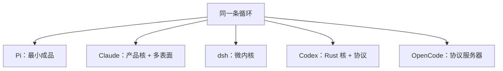
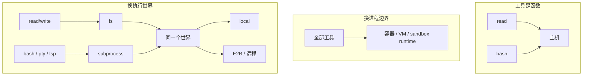

# Harness 到底怎么做

coding agent 的循环长得几乎一样：

```text
人的输入
  → 拼 system prompt + tools
  → 调模型
  → 跑工具
  → 写回会话
  → 要不要下一轮
```

五套主流 harness 都围着这条循环转。分歧不在循环有没有，而在八个关节怎么切：内核是什么、能力怎么挂、会话存成什么、代码在哪跑、扩展插在哪。把这八个关节对齐了，才能看清「harness 到底怎么做」，而不是五份产品手册各说各话。

对照的是 Pi、Claude Code、DeepSeek Harness（dsh）、Codex、OpenCode。材料来自各自公开文档和源码树，不是评测分数。

## 先认五套东西

**Pi** 是最小 TUI 成品。默认只给模型 `read` / `write` / `edit` / `bash`。哲学页几乎是一份拒绝清单：不内置 MCP、sub-agent、权限弹窗、plan mode、todo、background bash。扩展是往家里丢一个 TypeScript 文件。内核是 `AgentSession`，你在装饰它，不能换它。

**Claude Code** 是闭源产品核，同一条 agentic loop 铺到终端、IDE、桌面、浏览器和云端 VM。官方自己把 Claude Code 叫成「套在模型外面的 agentic harness」：工具、上下文管理、执行环境。扩展层极厚，但是产品形的——CLAUDE.md、Skill、Hook、MCP、Subagent、Agent team、Plugin marketplace。Agent SDK 把同一条二进制嵌进你的程序。

**dsh** 把「没有特权核」做成仓库纪律。Cordis 上每个东西都是插件，包括 loop 自己。能力按 Service Definition / Provider / Consumer 成套出现。会话是只追加的事件日志，硬约束是 *Model-visible ⟺ logged*。组合是声明式 patch，配错就 boot 失败。

**Codex** 的开源面是一套 Rust crate。`codex-core` 跑 loop，`codex-protocol` 放类型，TUI 和 `app-server` 是两个客户端。会话单位从 Conversation 改名叫 Thread，落盘叫 Rollout（带 timestamp / ordinal 的 JSONL）。沙箱和审批是一等公民：Seatbelt、bwrap、Windows sandbox、execpolicy。产品跨 CLI、IDE、桌面和 Codex Web。

**OpenCode** 是开源的 TypeScript + Effect 运行时。依赖方向写进 AGENTS.md：Schema → Core / Protocol → Server，Client 不许碰 Core。对外合同是 HTTP API；所谓 Embedded OpenCode，只是对同一套 router 打一条内存里的 `HttpClient`。它对「系统上下文」的建模，是五套里最细的。



## 关节一：内核是什么

这是第一刀。你到底在保护什么，不让人改。

| | 内核 | 特权在哪 | 换 loop？ |
|---|---|---|---|
| Pi | `AgentSession` + 四个工具 | 产品核 | 不能 |
| Claude | agentic loop + 内置工具 | 闭源二进制 | 不能，SDK 嵌的是同一条 |
| dsh | Cordis（ctx / event / effect） | 几乎没有 | 能，且禁止依赖实现包 |
| Codex | `codex-core` + protocol | Rust 核 | 不能，客户端换皮 |
| OpenCode | Schema + Protocol + Session runtime | HTTP API | 不能，换的是 Client |

Pi 和 Claude 的内核都是「一个 agent」。差别是厚度：Pi 把功能赶出内核，Claude 把功能做成内核上的产品层。你用 Claude，是在一个完整产品里勾选 Skill / Hook / MCP；你用 Pi，是自己把缺的功能写出来。

Codex 和 OpenCode 把内核收成「协议 + 运行时」。TUI、桌面、IDE 都是客户端。Codex 的 `codex-protocol` 明文写着：这个 crate 只放类型，不放业务。OpenCode 更狠——连 Embedded 模式都不走「直接调 Core」，而是内存里打 HTTP。这意味着 **UI 和 loop 之间只有一份合同**，多表面不是后来打的补丁。

dsh 是另一条路。它不保护某一个 loop，它保护分类：事件分 Session / Agent / Capability 三域，注册必须可回滚，capability 必须成套。`dsh-agent-loop` 甚至被规定仓库里谁都不许依赖它。loop 可换在这里是分类学的证明义务，不是产品需求——至今几乎没人真的换。

做 harness 时这一刀决定后面所有形状。你要是保护一个 agent 产品，扩展就会长成「往成品上挂钩子」。你要是保护一份协议，多表面是免费的，个人扩展会变重。你要是保护一套分类，系统能重组，但下午丢 30 行文件改产品这件事，基本做不到。

## 关节二：组合方式

内核定了，插件怎么进树。

**Pi 是发现式。** 扫 `~/.pi/agent/extensions/`、项目 `.pi/`、`settings.json`、pi packages。项目级东西先过 `project_trust`。心智：往家里丢文件，agent 就变了。`/reload` 热更。

**Claude 是分层配置。** 用户 / 项目 / managed policy / plugin，各写各的 CLAUDE.md、`settings.json`、hooks、skills。同名 skill / subagent / MCP 按优先级覆盖；CLAUDE.md 和 hooks 是相加的。企业侧还有 server-managed settings。心智：约定写在 markdown 里，策略写在 settings 里，分发靠 marketplace。

**dsh 是声明式。** 从空列表叠：`dsh-base` → web/headless bundle → profile patch → home patch → `--patch`。每一行有 id，上层整行替换，没有 deep merge。`dsh --dump-config` 打印的就是真实会 boot 的树。配错的 referent 直接炸，不许悄悄跳过。

**Codex 是配置层 + feature flag。** `config.toml`、managed features、plugin crate、MCP。Thread 启动时把 config 拍成一份 `TurnContext`。组合发生在 Rust 核内部，不是一份可以 dump 出来的插件树。

**OpenCode 是 Config + Plugin 模块。** `opencode.json` 里列 plugin；一个 plugin 是 `(input) => Hooks`。Workspace 可以注册 adapter，指到 local directory 或 remote URL。组合是配置，运行时靠 Effect Layer 把服务接起来。

发现式适合一个人的家。声明式适合同一套代码要长成 Web / headless / ACP / 远程沙箱，而且配错必须响。Claude 走的是第三条：用「分层 markdown + 策略文件」让团队能把约定当代码养，又不要求每个人会写插件。

一个具体后果：Windows 上 bash 和 pwsh 互斥，dsh 写在同一份 patch 的 `disabled: !!js process.platform === 'win32'` 里。组合是数据。Pi / Claude / Codex 这类判断散落在产品和核里，改起来是改代码。

## 关节三：能力是函数，还是世界

工具看起来都是 `read` / `bash` / `edit`。底下的模型完全不同。

Pi 的工具就是函数。`bash` 在这台机器上跑 bash。想换执行环境，你自己包一层，或者让人去容器里跑整个 pi。文档写得很直：权限弹窗自己做，沙箱用 Gondolin / Docker / OpenShell。

Claude 的内置工具也是函数，但它把「隔离」做成了产品选项，而且分得很清楚：

- **Sandboxed Bash**：只困住 Bash 和它的子进程。`Read` / `Edit`、MCP、hooks 仍在主机上
- **Sandbox runtime**：整颗 Claude Code 进程进隔离，包括文件工具和 MCP
- **Dev container / VM / 云端**：整个环境换掉

权限模式决定「问不问你」，隔离决定「跑起来能摸到什么」。`--dangerously-skip-permissions` 官方要求放进容器、VM 或 sandbox runtime。这是产品级的执行世界，但工具实现并没有跟着 provider 走——换环境是换进程边界，不是换 `ctx.fs`。

dsh 把能力拆成固定三角：

```text
Service Definition   声明 ctx.fs / ctx.shell / ctx.subprocess
Service Provider     local / sandbox / E2B
Consumer             read/write/edit、bash、lsp……
```

不变量是：**文件系统和子进程共享一个执行世界。** 把这两个 provider 指到远程沙箱，Bash、PTY、LSP 一起走，不用分叉工具。这是 dsh 最值钱的想法。

Codex 接近 Claude 的「核内沙箱」，但工程更沉。`sandboxing`、`exec_policy`、`linux-sandbox`、`windows-sandbox`、`bwrap` 都是 crate。工具编排在 `tools/orchestrator`，审批在 `tools/approvals`。执行世界是核的一部分，不是可热插的 provider。你换的是策略，不是世界。

OpenCode 多走了半步。Plugin 可以注册 `WorkspaceAdapter`，target 是 local directory 或 remote URL。PTY、filesystem、shell 都挂在 Location 上。它有「工作区可指到别处」的形状，但还不是 dsh 那种「换两个 provider，整棵工具树跟着走」的 seam。



做 harness 时这一刀决定你能不能「同一套工具，换一个后端」。函数模型下午就能跑；世界模型让远程沙箱、landlock、E2B 变成配置，而不是新写一套 `bash`。

## 关节四：会话是什么

这是数据模型上最深的分水岭。五套其实落在四种东西上。

**Pi：对话树。** JSONL，`id` / `parentId`，原地分叉。`/tree` 跳到任意节点继续，`/fork` `/clone` `/compact` 都是树上的手术。心智：对话是可编辑的工件。人会回跳、会剪枝。

**Claude：按项目存的 transcript。** 本地文件，随做随写。`--continue` / `--resume` / `/resume` 恢复对话、模型、agent、权限模式、未完成的 goal。可以 branch。桌面、Web、VS Code 各自一份历史，并不共用一条日志。心智：会话是「某次干活的存档」，为人和多设备恢复服务，不为多个投影同时读同一条真相服务。

**dsh：只追加的事件日志。** `turn/start`、`user/message`、`assistant/chunk`、`tool/call`、`tool/result`。模型看到的历史是 `deriveMessages()` 投出来的。硬约束：模型请求里出现的任何东西，都必须能从 log 重建，运行时有 invariant。fork 是按边界拷一份，compaction 是追加事实，不是改写历史。心智：UI、标题、telemetry、resume、给模型的 messages，都是投影。

**Codex：Rollout。** 也是 JSONL，但条目是 `RolloutItem`，带 timestamp 和 ordinal。`ThreadManager` 负责 new / resume / fork，`RolloutRecorder` 负责落盘。Session 内部有 turn、input queue、`world_state`。命名上 Conversation 整棵改成 Thread，是在承认「这不是一次聊天，是一条可恢复的执行线程」。它比 Pi 的树更接近事件源，但 resume / 投影仍由核内逻辑完成，没有 dsh 那种「新的模型可见输入必须先有新 event」的公开定理。

**OpenCode：有类型的 Session 域。** 会话历史是投影；系统上下文是另一份东西。它把好几个常被混在一起的词拆开：

| 它的词 | 是什么 | 不是什么 |
|---|---|---|
| System Context | 一组 typed Context Source 拼出来的当前事实 | 不是「system prompt」这个袋子 |
| Session History | 过了 compaction 和 Context Epoch 裁剪后的对话投影 | 不是整份 session 文件 |
| Session Drain | 进程内一次把该跑的 Provider Turn 跑完 | 不是可恢复的实体 |
| Admitted Prompt | 进了 inbox、还没晋升进历史的输入 | 不是已经给模型看过的消息 |
| Context Epoch | 一份 Baseline System Context 保持不变的区间 | 不是 turn |

上下文变更不在 source 变化时推给模型，只在 **Safe Provider-Turn Boundary** 被承认。多个 Context Source 的变更合成一条 Mid-Conversation System Message。Compaction 开启新的 Epoch，旧的系统更新留作审计，不再进入投影。

这是五套里唯一把「给模型看的系统事实」和「对话历史」彻底拆开的设计。dsh 用「全部落进同一条 log，再用投影取 messages」达到类似效果；OpenCode 在类型上就禁止你把它们混成一个袋子。

- 一个人在终端里剪时间线：树最干净（Pi）
- 一个人跨设备把活捡起来：transcript 最省事（Claude）
- 许多投影、许多协议、许多子代理同时读同一条真相：事件日志（dsh / Codex Rollout）
- 系统事实会在对话中途变，还要保住 prompt cache：OpenCode 的 Context Epoch

会话模型决定产品能长成什么。选错了，后面所有 UI 和多 agent 都会别扭。

## 关节五：事件是给谁用的

大家都有「事件」。听众不是同一拨人。

Pi 的事件是给扩展作者的产品生命周期：`session_start`、`tool_call`（可 block）、`tool_result`（可改）、`turn_start` / `turn_end`。`ctx.ui.confirm` 长在同一条路上。权限确认是 extension 里直接弹框。

Claude 的 Hook 是自动化插口，不是通用中间件。`PreToolUse` / `PostToolUse` / `SessionStart` 上跑你的脚本、HTTP、prompt 或 subagent。官方把边界划得很清：必须每次以同一方式发生的事放 hook（lint、禁 `rm -rf`）；需要模型理解的事放 skill。Hook 是强制，CLAUDE.md 是请求。

dsh 先分三个域，再谈功能：

| 域 | 例子 | 干什么 |
|---|---|---|
| Session（持久） | `turn/start`、`assistant/chunk` | 必须活过 reload 的事实 |
| Agent（活的） | `agent/pre-step`、`agent/request` | 拦截飞行中的工作 |
| Capability | `tools/pre-execute`、`fs/*` | 往缝上挂策略，不 import loop |

dispatch mode 是契约：waterfall 必须 `next()`，否则短路；serial 是按序检查点；parallel 每个监听者都要跑完；emit 只观察。证明义务是一张表：每个产品功能必须能指到一个扩展点，没有一行改 loop。

Codex 的事件走 protocol：core 往 TUI / app-server 推 `Event`。Hook crate 和 extension API（`PromptFragment`、`PromptSlot`、`TurnContextContribution`）是核开给插件的窗。对外是「线程上发生了什么」，对内是「这一 turn 的上下文谁来补一段」。

OpenCode 的对外事件是 HTTP / 生成客户端上的 `Event`。对内，Session 域自己有 durable event manifest、projector、runner。插件看到的是 Hooks，不是 Cordis 那种 typed waterfall。公共合同是 API，不是事件分类学。

一句话：Pi / Claude 的事件回答「用户扩展怎么插手」；Codex / OpenCode 的事件回答「客户端怎么订阅一条线程」；dsh 的事件回答「系统各部分凭什么不互相 import」。

## 关节六：几个 agent

Pi 哲学上就一个。要并行，tmux 再开一个 pi，或者自己写 extension。世界很简单：一人、一目录、一轮对话。

Claude 把并行做成了产品阶梯，而且每一级的隔离模型不同：

- **Subagent**：会话内的隔离工人，自己的 context window，只把摘要交回主对话
- **Agent view**：一台机器上很多独立 session，一个屏幕盯
- **Agent team**：独立 Claude Code 实例，彼此发消息，共享任务列表
- **Dynamic workflow**：Claude 写一段脚本，编排许多 subagent，可重跑

Skill 是内容，subagent 是隔离。官方连「什么时候从 subagent 升级到 team」都写了：subagent 需要互相对话，或主窗口被淹没时，再上 team。这是产品经理切的并行，不是作用域原语。

dsh 从第一天按多 agent 设计。`scope` 是独立原语：注册分 global / scoped，scoped 的 key 按惯例是那个 live agent；**不继承**；父子只是数据（`parentSession`、`delegationDepth`），不参与可见性；同名 scoped 注册会 shadow 全局。后面的 in-process / fork / ACP / 把活交给 Claude 或 Codex，都是同一条 subagent provider 缝。

Codex 有 `multi_agents`、`codex_delegate`、`agent_communication`，Thread 之间能委派。协作模式是 config 里的 mask，不是 scope 原语。它承认多 agent 是核要处理的事，但模型是「线程之间通话」，不是「注册可见性」。

OpenCode 的 Agent 是 Session 上的一个选择（哪个 agent、哪个 model）。并行更多靠多个 Session + Location / Workspace。没有 dsh 那种扁平两层 scope，也没有 Claude 那种 team 产品。

做 harness 时这一刀经常被推迟，然后在 loop 里长出一堆特殊情况。能选的其实就三条：

1. 拒绝，让用户用进程隔离（Pi）
2. 做成产品阶梯：隔离工人 / 独立会话 / 能互相说话的会话（Claude）
3. 做成作用域原语，子代理只是 provider（dsh）

Codex 和 OpenCode 走在 2 和 3 之间，还没有把可见性收成一条定理。

## 关节七：代码在哪跑

「Agent 在哪干活」是 harness 之所以叫 harness 的原因。模型是 CPU，执行环境才是这层该管的东西。

| | 默认 | 收紧一档 | 换整台机器 |
|---|---|---|---|
| Pi | 主机 | 你自己上容器 | 部署问题 |
| Claude | 主机 | sandboxed bash / sandbox runtime | 官方云 VM、self-hosted runner |
| dsh | `ctx.fs` + `ctx.subprocess` 的 local provider | landlock / bwrap / seatbelt provider | E2B provider，工具树跟着走 |
| Codex | 主机 + 默认 sandbox 策略 | Seatbelt / bwrap / Windows sandbox + execpolicy | Codex Web / 远程环境 |
| OpenCode | Location 上的本地 workspace | 权限系统 | WorkspaceAdapter → remote |

Claude 把这层做成了企业产品：cloud environment、self-hosted runner、gateway、spend limit、session identity JWT。Codex 把这层做成了系统软件：策略语言、平台沙箱、审批流。dsh 把这层做成了可替换后端。Pi 拒绝做，认为这是部署。OpenCode 用 Location / Workspace 把「在哪」标进运行时，但远程还是 adapter，不是整棵能力树换根。

一个常被混的区别：**权限**和**隔离**不是一回事。权限决定问不问你、让不让跑；隔离决定跑起来能摸到什么。Claude 的文档把这句写死了。Pi 只做前者的「请用容器」版本。dsh 和 Codex 两者都做，挂点不同——dsh 挂在 provider 上，Codex 挂在核内 sandbox + execpolicy 上。

## 关节八：扩展挂在哪

最后才是大家最爱谈的「插件」。这个词在五套里不是一个东西。

| | 扩展是什么 | 典型动作 | 目标用户 |
|---|---|---|---|
| Pi | 成品上的 TS 模块 | `pi.registerTool` / `pi.on("tool_call")` | 今天下午想加一个确认框的人 |
| Claude | 产品功能的包装 | 写 CLAUDE.md / Skill / Hook，装 Plugin | 团队把约定养成仓库的一部分 |
| dsh | 系统的全部 | 加一组包 + seam + catalog | 要组一条产品线的人 |
| Codex | 核开的窗 | hook、plugin、MCP、skill、prompt slot | 要补一段上下文或拦一层工具的人 |
| OpenCode | 返回 Hooks 的模块 | 注册 tool / auth / workspace adapter | 要接自己的模型和远端工作区的人 |

Claude 把「什么时候加什么」写成了一张触发表：约定错两次 → CLAUDE.md；同一句 prompt 打第三遍 → Skill；Claude 看不见的系统 → MCP；副作用必须发生 → Hook；第二份仓库要同一套 → Plugin。这不是架构分类，是产品教学。但它逼你承认：扩展有好几种，混用会把 CLAUDE.md 养成垃圾场。

dsh 的对应纪律是：新行为只能挂已有延伸点，改 loop 必须改架构图。Pi 的对应纪律是：这些事有很多做法，内核一种都不做。

两边最不该混的，是把 Pi 那种「随手丢 TS」的扩展体验，和 dsh 那种「缺一行 config 就 boot 失败」的组合纪律，假装能同时最大化。Claude 用产品层把这件事抹平了——你感觉在写 markdown，底下仍是一个不能换的核。

## 一张总表

| | Pi | Claude | dsh | Codex | OpenCode |
|---|---|---|---|---|---|
| 产品形态 | 最小 TUI | 全表面产品 | 微内核 + 多发行面 | Rust CLI + 多表面 | 开源协议服务器 |
| 内核 | 一个 agent | 一个 agent | 一套分类 | core + protocol | schema + protocol |
| 组合 | 发现 / 热更 | 分层配置 | 声明式 patch | config + features | config + Effect Layer |
| 能力 | 函数 | 函数 + 隔离档位 | Definition / Provider / Consumer | 核内工具 + 沙箱策略 | Location 上的工具 |
| 会话 | 对话树 | transcript 存档 | 事件日志 + 投影 | Rollout 线程 | Session 域 + Context Epoch |
| 多 agent | 拒绝 | 产品阶梯 | scope 原语 | 线程委派 | 多 Session |
| 执行世界 | 主机 | 主机 / runtime / 云 VM | 可整体替换 | 平台沙箱 + 策略 | local / remote workspace |
| 扩展 | 用户 TS | markdown + plugin | 系统本身 | hook / plugin / MCP | Hooks 模块 |
| 源码 | 开源 | 闭源 + SDK | 开源 | CLI 开源 | 开源 |

## 它们各自在赌什么

**Pi 赌的是：coding agent 的差异化不该进内核。** 内核稳了，生态用 extension 和 pi package 长。代价：执行世界、多 agent、跨 UI 一致性都不是一等的。

**Claude 赌的是：大多数人不要架构，要一张「何时加何物」的表，以及同一条 loop 出现在所有表面上。** 闭源核换来的是企业分发、云端执行、权限模式、team。代价：你不能重组它，只能配置它。Agent SDK 让你嵌同一条二进制，不是换一套缝。

**dsh 赌的是：coding agent 会变成平台，平台不能有特权核心。** Web、ACP、Python SDK、远程沙箱、子代理、自修改，都得是同一套事件和缝上的不同叠法。代价：个人扩展很重，本体词汇表已经开始像一座教堂。

**Codex 赌的是：这层该是系统软件。** Rust、protocol crate、rollout、平台沙箱、execpolicy、Thread 而不是 Chat。开源 CLI 是核的一个客户端，不是产品的全部。代价：扩展面比 Claude 薄，比 Pi 重，分类学没有 dsh 干净。

**OpenCode 赌的是：对外合同是 HTTP，对内合同是类型。** System Context 不该是一段 prompt 字符串；Session Drain 不该冒充可恢复实体；Client 不该 import Core。代价：Effect + 这套词汇，让「下午写个插件」的门槛接近 dsh，而 seam 还没有 dsh 那么成套。

## 如果你明天要做一套

不必五套都学。先把四件事拍板，后面的功能都是挂上去的。

**会话存成什么。** 树、transcript、事件日志、还是带 Context Epoch 的 Session 域。这一刀决定 fork、compact、多 UI、审计能不能从同一份材料长出来。能选的话，日志或 OpenCode 那种「历史是投影、系统事实另存」比树更经得住多表面。一个人的 TUI，树更舒服。

**能力是不是一个世界。** 如果远程沙箱、本机、landlock 只是部署差异，函数模型够了。如果同一套 `read` / `bash` / LSP 必须换根，从第一天就做 Definition / Provider / Consumer，别事后打补丁。

**几个 agent，可见性怎么算。** 拒绝、产品阶梯、还是 scope。最怕的是「先做一个，以后再加 subagent」，然后在 loop 里写特殊情况。dsh 的「不继承、血缘只记账」是这层最干净的定理。

**扩展挂在成品上，还是系统就是插件。** 面向今天下午的人，学 Pi 的 ExtensionAPI 和 Claude 的触发表。面向一条产品线，学 dsh 的 patch 和 OpenCode 的「Client 不许碰 Core」。不要假装两种体验能同时最大化。

loop 本身反而不是第一刀。五套的循环都长得一样。Claude 说得对：harness 是套在模型外面的工具、上下文和执行环境。真正要设计的是这三样怎么切开、怎么替换、怎么证明没有私货溜进模型请求。

dsh 用 *Model-visible ⟺ logged* 证明这件事。OpenCode 用 Context Snapshot 和 Safe Provider-Turn Boundary 证明这件事。Pi 用「内核小到没什么可藏」回避这件事。Claude 和 Codex 用产品和核内纪律保证这件事，但不把它写成一条对外定理。

你要是只偷一个想法：先写一条能证伪的不变量，再写 loop。功能会长，关节不会每周改。关节切错了，功能只是把错误长得更大。

相关：[[dsh-vs-pi-architecture]]。

## 我的笔记
