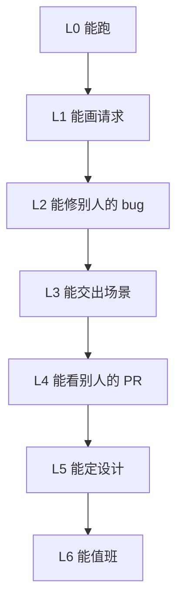

# SGLang 通往 Maintainer 的路径

写于 2026-08-13。仓库在 `~/workspace/code/sglang`，fork 是 `infdahai/sglang`，当前还没有自己的 commit。

“顶尖大佬”在这个项目里不是头衔，是四件事同时成立：

1. 能独立修自己责任田里的生产事故
2. 别人改这块代码会主动找你 review
3. 你提的设计能过 Merge Oncall，而不只是修小 bug
4. 最终出现在 [MAINTAINER.md](https://github.com/sgl-project/sglang/blob/main/.github/MAINTAINER.md) 或 [CODEOWNERS](https://github.com/sgl-project/sglang/blob/main/.github/CODEOWNERS)

官方晋升路径写得很直白：先持续贡献，再让 Lianmin / Ying 在 Slack 提名。没有这条路径之外的捷径。

## 这个项目怎么认人

角色从低到高：

| 角色 | 你能做什么 | 现实含义 |
|---|---|---|
| 路人 PR | 修文档、测例、小 bug | 现在的你 |
| 可信贡献者 | 自己的 PR 能要到 `run-ci` | 大约 1–3 个月 |
| CI 权限用户 | 进 `CI_PERMISSIONS.json` | 别人开始拿你当自己人 |
| Write | 能 merge 已批准的 PR | 你开始值班，不只是投稿 |
| Codeowner | 你负责的文件没你 +1 不能合 | 被动保护，责任很重 |
| Merge Oncall | 能绕过 flaky CI 合入，出了锅你 revert | 这块的实际主人 |

对你最重要的责任田，按机器人推理和现有缺口选：

| 田 | 目录 | Merge Oncall / Codeowner | 为什么是你的 |
|---|---|---|---|
| **主田** | `python/sglang/srt/multimodal` | @mickqian @JustinTong0323 @yhyang201 @yuan-luo | VLA / 带图控制的入口 |
| **主田** | VLM models，如 `qwen2_5_vl.py` `qwen3_vl.py` `internvl.py` | models / NV 优化组 | 模型怎么被引擎吃进去 |
| **副田** | `srt/mem_cache`，尤其 `multimodal_cache.py` `session_radix_cache.py` `radix_cache.py` | Lianmin / Ying / hnyls2002 / xiezhq-hermann | 连续控制的命根 |
| **副田** | `srt/session` | managers 组 | 多步请求复用 KV |
| **后期** | `srt/constrained` | hnyls2002 | 动作必须合法 |
| **后期** | `srt/disaggregation` 的 encode 路径 | Byron / Shangming | EPD，多机器人共享视觉 |
| **不要先碰** | DeepSeek EP、sgl-kernel、GB200 PD、diffusion | 核心老人主战场 | 你进去只能当搬砖，建不成判断 |

一句话：先成为 **multimodal + session/cache** 的人，再谈 Scheduler 内核和大模型 EP。

## 能力阶梯，不是课程表

按“你能不能独立交货”升级，不按“你读完了哪篇”。



每一级都有**出门证**。没拿到，不准自我感觉进下一级。

### L0 · 环境能跑

出门证：本机或 Docker 里 `sglang serve` 拉起一个小模型和一个 VL 模型，`/generate` 和 `/v1/chat/completions` 都能回。

必做：

- 源码安装，跟 `main`，不要跟 release tag 做开发
- `pre-commit install`
- 跑通 `pytest test/registered/unit/managers/ -q` 里不需要 GPU 的部分
- 加 Slack：`#dev` `#pull-request` `#ci-cd-build-release`
- 看一次 [Weekly Dev Meeting](https://meet.sglang.io/)

官方指定入门材料，按这个顺序，不要自己乱找：

1. [Mini-SGLang](https://github.com/sgl-project/mini-sglang)
2. [Code Walk-through](https://github.com/zhaochenyang20/Awesome-ML-SYS-Tutorial/tree/main/sglang/code-walk-through)
3. [RadixAttention 博客](https://lmsys.org/blog/2024-01-17-sglang/)
4. [v0.4 zero-overhead scheduler](https://lmsys.org/blog/2024-12-04-sglang-v0-4/)
5. 仓库内 `.agents/skills/write-sglang-test` 和 `generate-profile`

### L1 · 能徒手画出一次请求

出门证：合上电脑，能讲清一次带图 `/generate` 经过哪些进程、哪些锁、哪些队列。讲不清 overlap 和 retract，就还没毕业。

按这个文件顺序读，每读一个就在笔记里补一列“它决定什么 / 它怎么死”。

| 顺序 | 文件 | 你要能回答 |
|---|---|---|
| 1 | `python/sglang/launch_server.py` | HTTP / gRPC / Ray / encoder-only 怎么分流 |
| 2 | `srt/entrypoints/http_server.py` 的 `/generate` | stream、abort、client disconnect |
| 3 | `srt/entrypoints/engine.py` 的 `Engine` 三件套注释 | 谁在主进程，谁是子进程 |
| 4 | `srt/managers/tokenizer_manager.py` `generate_request()` | pause、weight lock、mm_processor、rid 泄漏 |
| 5 | `srt/managers/multimodal_processor.py` + `srt/multimodal/processors/` | 图何时变成 embedding / hash |
| 6 | `srt/managers/scheduler.py` `event_loop_overlap()` | CPU 和 GPU 怎么重叠 |
| 7 | `handle_generate_request()` / `waiting_queue` | session 和普通请求分叉 |
| 8 | `get_next_batch_to_run()` | chunked prefill、retract、混批 |
| 9 | `srt/managers/tp_worker.py` | 真正 forward |
| 10 | `srt/mem_cache/radix_cache.py` + `multimodal_cache.py` | 第二次相同前缀为什么更快 |
| 11 | `srt/managers/detokenizer_manager.py` | token 怎么回到 HTTP |

配套实验，不做实验等于没读：

```text
同一 system prompt + 每步一张新图 + 短输出
连续 100 步
记录：TTFT / TPOT / P99 / cache hit / 是否被 retract
```

过关标准：你能指出 P99 抖动是卡在编图、入队、别人的 prefill，还是 decode。

### L2 · 能修别人的 bug

出门证：合进去 **3 个非文档 PR**。文档可以先发，但不计在这 3 个里。

从哪里找活：

- label：`good first issue` `help wanted` `multimodal` `bug`
- 目录：`test/registered/vlm/`、`test/registered/unit/managers/`
- 现成缺口：`test_mm_hashes.py`、`test_tokenizer_manager_rid_cleanup.py`、`test_vision_chunked_prefill.py` 附近的 flake / 缺测
- Slack `#dev` 里没人认领的 VLM 报错

PR 纪律，按仓库自己的规矩：

- 永远从新分支提，不直接推 `main`
- 改 `srt/` 就补 `test/registered/unit/` 镜像测试
- 用 `CustomTestCase`，能 mock 就不要拉 server
- 跑 `pre-commit run --all-files`
- 改输出就跑 GSM8K 做 sanity，不把它当速度测试
- 描述里写：用户可见症状、根因、为什么不会让普通 LLM serving 变慢

前 3 个 PR 的正确形状：

1. 一个测试缺口或 flake
2. 一个 VLM / tokenizer 小正确性修复
3. 一个 cache / session / abort 路径上的泄漏或错误处理

不要一上来改 `scheduler.py`。这个文件 4300+ 行，Codeowner 是 Lianmin / Ying / hnyls2002。你没信用时，大改会被挂着。

### L3 · 能交出一个别人愿意引用的场景

出门证：仓库里留下一块 **机器人相关、可复现** 的东西。文档、benchmark、cookbook 都可以，但必须带数字。

推荐竖切，只做这一条：

> VLA serving 原型：Qwen2.5-VL 或 InternVL，固定 schema 的短动作，连续 1000 步。

必须量的数：

- 控制频率能不能稳住 10 / 20 / 50 Hz
- 图像 token 数 vs TTFT
- prefix / mm hash 命中率
- 动作合法率（上 structured output 前后）
- 多请求共享模型时，单机器人的 P99 掉多少

产出形态，按影响力从低到高：

1. 自己的笔记和脚本
2. `docs/` 或 `docs_new/cookbook` 里一篇
3. `benchmark/` 下一个 robot-style 数据集
4. 被别人的 VLM PR 引用

这一级开始建立你的公共身份：不是“又一个贡献者”，是“做连续多模态控制的那个人”。

### L4 · 能看别人的 PR

出门证：连续两个月，每周至少认真 review **2 个** multimodal / session / cache PR。不是刷 emoji，是能指出：

- 测试没盖到 abort / 空图 / 重复 hash
- overlap 路径上有隐藏 sync
- 把慢路径写进了 model forward
- 文件又要超过 2000 行该拆

怎么获取 review 权：先在 Slack 对口人面前混眼熟。

| 模块 | 你该认识的人 |
|---|---|
| multimodal | mickqian, JustinTong0323, yhyang201, yuan-luo |
| managers / scheduler | merrymercy, Ying1123, hnyls2002, xiezhq-hermann |
| mem_cache | ispobock, xiezhq-hermann, hnyls2002 |
| disagg encode | ShangmingCai, ByronHsu |
| constrained | hnyls2002 |

方法：修他们模块的 bug，review 里写人话，开会时对得上号。不要一进门就要 CODEOWNERS。

### L5 · 能定设计

出门证：一份 RFC 或设计 PR 被合入，而不是只修症状。

候选题目，必须落在你的田里：

- 图像 KV 和文本 KV 分开驱逐
- session 下 mm hash 的生命周期
- 控制环友好的 priority：decode 不被陌生 prefill 打断
- 动作 schema 和 reasoning 共存时的 grammar
- EPD：encoder 单独失败时，控制环如何在一个周期内降级

RFC 写法：问题、现有路径、两个方案、对普通 LLM serving 的影响、测试计划、回滚。没有“对普通路径的影响”这一节，Oncall 不会理你。

### L6 · 能值班

出门证：被写进 CODEOWNERS 或 Merge Oncall 列表。

这时你已经在做：

- 自己模块的 revert / hotfix
- 带新人看 multimodal PR
- CI 挂了先看是不是你的田
- 主动把 flaky VLM 测试修掉，而不是 rerun

从 L5 到 L6 不是学出来的，是 Oncall 觉得“这块没你晚上不踏实”。

## 12 个月怎么排

按季度，不按灵感。

### Q1 · 成为可信贡献者

目标：L0 → L2。仓库里留下 5+ 个合入，其中 ≥3 个非文档。

月度：

- 月 1：跑通、画请求、读 Mini-SGLang 和 walk-through、交 1 个文档或测试 PR
- 月 2：盯 VLM / managers unit 测试，交 2 个正确性修复
- 月 3：开始 100 步带图实验，交 1 个和 cache/session 相关的 PR

每周固定动作，写进日历：

- 1 次 Weekly Meeting
- 2 小时读 `scheduler.py` 或 `tokenizer_manager.py` 的一个函数，写笔记
- 扫 issue / Slack，认领或评论 1 个
- 至少推 1 个本地实验数字

### Q2 · 占住 multimodal

目标：L3。别人提到 VLM serving / 连续带图，会想到你。

- 完成 robot-style benchmark 并尝试上游
- 独立修 1 个中等 multimodal bug（encoder 调度、hash、chunked prefill）
- 开始每周 review 别人的 VLM PR
- 读完并做笔记：`cuda_graph_for_multi_modal_encoder.md`、`dp_for_multi_modal_encoder.md`、`epd_disaggregation.md`、`hicache_design.md`

### Q3 · 把副田打穿

目标：L4，cache/session 能独立判断。

- 精读 `radix_cache.py` `session_radix_cache.py` `multimodal_cache.py` `hiradix_cache.py`
- 修 1 个 cache 正确性或逐出问题
- 把“多机器人共享一个模型”做成可演示数字
- 评估要不要碰 constrained decoding；动作 schema 如果已经成为瓶颈，再进

### Q4 · 交设计，不要再只修 bug

目标：L5 起步。

- 提交 1 份 RFC
- 争取 CI 权限
- 在 meeting 上讲一次你的责任田
- 判断 EPD 是否值得作为第二年主线

12 个月结束时如果还没进 CODEOWNERS，不叫失败。失败是：还在裸读源码、没有合入、没有数字、没有对口人认识你。

## 每周操作系统

把学习变成班表，否则会被“再看一篇博客”吃掉。

| 时间块 | 做什么 | 不做 |
|---|---|---|
| 2 段 × 90 分钟深读 | 一个函数，对照实验 | 同时开 5 个文件 |
| 1 段 × 60 分钟上游 | issue / Slack / 别人的 PR | 刷 ARC / Kaggle |
| 1 段 × 90 分钟动手 | 本地 serving、profile、补测试 | 只记笔记不跑 |
| 1 段 × 30 分钟写作 | 把本周唯一新判断写进笔记 | 复制官方文档 |

笔记按模块拆，不要写一本“SGLang 大全”：

- [[sglang-request-path]] — 架构 01：进程模型与请求环（已写）
- `sglang-scheduler-loop.md` — 架构 02：waiting / running / retract / overlap
- `sglang-multimodal.md` — processor、hash、encoder graph
- `sglang-radix-session.md` — cache 与连续控制
- `sglang-pr-log.md` — 每个 PR 的症状、根因、review 意见

## 判断题，用来防止走偏

每周问一次。有一个答“是”，就在偏航。

1. 这周有没有产生一个别人能复核的数字或 PR？没有就是假学习。
2. 是不是又想去啃 DeepSeek EP / kernel？Q1–Q2 一律否。
3. 是不是把 Agentic RL 框架当成了主线？只保留 SGLang 的换权重 / sleep / logprob 合同。
4. 是不是在用 ShareGPT TPS 证明机器人能用？换控制频率和 P99。
5. 这个改动会不会让普通 LLM serving 变慢？会的话 PR 别提，或先证明可关。

## 明确不做

- 不把 π0 / OpenVLA 整模型硬塞进 `srt/models`，却说不清 cache 语义
- 不在 SGLang 外包一个“机器人推理框架”
- 不打 ARC / Kaggle 当主线
- 不三个 RL 框架一起读
- 不在没合入 3 个 PR 前要 CODEOWNERS
- 不把 `scheduler.py` 继续堆到更不可读；要改，先拆，再动行为

## 和机器人推理的关系

这条路径不是“顺便服务一下机器人”。主田就是为它选的。

机器人要的东西，映射到你要占领的模块：

| 真机需求 | 你要变强的模块 |
|---|---|
| 每步都看图，还得赶上周期 | multimodal processor + encoder graph |
| 系统提示和历史不能每步重算 | radix / session / mm cache |
| 多机共享一个大脑 | EPD / PD，Q4 再碰 |
| 动作必须合法 | constrained，Q3 按需 |
| 边训边推 | `update_weights_*`、`release_memory_occupation`，当合同来学，不当框架来学 |

## 第一周就做的 7 件事

不要等“准备好了再开始”。这 7 件做完，L0 才算开工。

1. Slack + 订阅 Weekly Meeting
2. `pre-commit install`，确认 fork 的 `main` 能快进官方 `sgl`
3. 跑一个 1B 文本模型和一个小 VL 模型
4. 读完 Mini-SGLang，对照本仓库画出三进程图
5. 精读 `Engine` 类文档字符串 + `TokenizerManager.generate_request()`
6. 扫 20 个 open issue，标记 5 个你能在 30 天内修的
7. 开 `sglang-pr-log.md`，即使还是空的

第一周结束时只允许有两种状态：环境通了、issue 列表在手上；或者写下卡在哪一步。不允许“还在看资料”。
