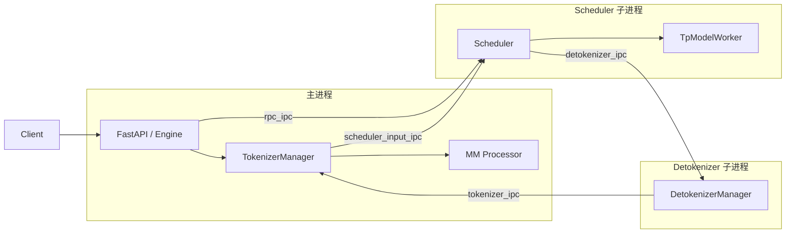

# SGLang 架构 01 · 进程模型与请求环

这是架构系列的第一篇。只回答一件事：

> 一个请求从客户端进来，到第一个 token 回去，经过哪些进程、哪些对象、哪几根管子。

Scheduler 怎么组 batch、Radix 怎么命中、图像怎么编，下一篇再拆。先把坐标系立住。

源码口径在两个地方写死了，几乎一字不差：

- `python/sglang/srt/entrypoints/engine.py` 的 `Engine` 文档字符串
- `python/sglang/srt/entrypoints/http_server.py` 的 `launch_server()` 文档字符串

> 引擎三件套：TokenizerManager、Scheduler、DetokenizerManager。  
> HTTP / Engine / TokenizerManager 在主进程。  
> Scheduler、Detokenizer 是子进程。  
> 进程间用 ZMQ IPC。

## 先记住三句话

**TokenizerManager 是前台。** 它见过 HTTP 请求、图、pause、换权重、abort。它不碰 GPU。

**Scheduler 是后台唯一知道排队和 KV 的人。** 它在自己的进程里死循环，决定谁跑、谁等、谁被踢回去。

**Detokenizer 是回程翻译。** 它把 token 变成文本，再塞回 TokenizerManager 的 `rid_to_state`。

HTTP 只是外壳。Python `Engine.generate()` 和 FastAPI `/generate` 最后都进同一个 `TokenizerManager.generate_request()`。

## 怎么被拉起来

两条入口，底层是同一套 `_launch_subprocesses()`。

```text
sglang serve / python -m sglang.launch_server
        │
        ▼
launch_server.py::run_server()
        │
        ├─ encoder_only        → encode_server / encode_grpc_server
        ├─ smg_grpc_mode       → grpc_server.serve_grpc
        ├─ use_ray             → ray.http_server.launch_server
        └─ 默认                → http_server.launch_server
                                      │
                                      ▼
                         Engine._launch_subprocesses()
```

离线、训练框架、自己写脚本时，直接 `Engine(...)`，跳过 FastAPI，但子进程布局一样。

`_launch_subprocesses()` 的顺序值得记：

1. `PortArgs.init_new()` 分配 ZMQ 地址
2. 拉起 Scheduler 子进程（可能多个：TP / DP / PP）
3. 非 0 号节点到此为止，不跑 tokenizer
4. 拉起 Detokenizer 子进程
5. 主进程里构造 `TokenizerManager`
6. `wait_for_ready()`，等模型权重加载完
7. 挂上 `SubprocessWatchdog`，子进程死了主进程也别装活

单机默认长这样：



多节点时，只有 `node_rank == 0` 跑 Tokenizer / Detokenizer。其他节点的 Scheduler 加载完权重就堵在那儿，只当计算工人。

## 三根管子

地址在 `PortArgs`（`server_args.py`）。单机默认是 `ipc://` 临时文件；跨机改 TCP。

| 字段 | 方向 | 谁连 |
|---|---|---|
| `scheduler_input_ipc_name` | Tokenizer → Scheduler | PUSH / PULL |
| `detokenizer_ipc_name` | Scheduler → Detokenizer | PUSH / PULL |
| `tokenizer_ipc_name` | Detokenizer → Tokenizer | PUSH / PULL |
| `rpc_ipc_name` | Engine → Scheduler | DEALER，控制面 |

请求走前三根。换权重、flush cache、pause 这类控制命令走 `rpc_ipc`。

TokenizerManager 建 socket 的代码在 `init_ipc_channels()`：

- `recv_from_detokenizer`：PULL，听回程
- `send_to_scheduler`：PUSH，发 tokenized 请求

多 tokenizer worker 时会多一个 router，请求先打到 worker 私有 IPC，再汇到 Scheduler。Q1 先当它不存在。

线上 IPC 默认走 **msgspec + msgpack**。图、time stats 这类不规则对象会被包进 `PickleWrapper`，外层结构仍然是 msgpack。这是 `io_struct.py` 里 `BaseReq` 的设计：热路径要快，但不能对网上来的东西直接 `pickle.loads()`。

## 一个请求的两种皮

客户端看到的是 `GenerateReqInput`（普通 dataclass，FastAPI 能解析）。  
Scheduler 看到的是 `TokenizedGenerateReqInput`（`msgspec.Struct`，按 rid 路由）。

分界线在 TokenizerManager。它负责把“人话 + 图”变成“token + mm_inputs”。

`GenerateReqInput` 里和机器人相关的字段，现在就可以对上号：

| 字段 | 含义 | 你以后要盯的点 |
|---|---|---|
| `text` / `input_ids` / `input_embeds` | 三种喂法，三选一即可 | VLA 可以直接喂 embedding |
| `image_data` / `video_data` / `audio_data` | 路径、URL、base64、预计算特征 | 大图会打爆主进程内存 |
| `mm_hashes` | 调用方自带的图哈希 | 外部 router 和内部 prefix cache 对齐 |
| `session_id` | 稳定会话身份，不改 prompt | 连续控制的轻量挂载 |
| `session_params` | 在已有 session 上续写 / 替换 / 截断 | 多轮真正复用 KV |
| `stream` | 流式回包 | 控制环不该等完整 JSON |
| `rid` | 请求主键 | 整个环都靠它找状态 |
| `priority` | 调度优先级 | 多机器人共享时隔离延迟 |
| `return_logprob` | 返回 logprob | RL rollout 合同 |
| `bootstrap_*` | PD / EPD 握手 | Q4 再碰 |

过了 Tokenizer 之后，多出来的关键字段是 `mm_inputs` 和已经解析好的 `sampling_params`。Scheduler 不再看见原图。

## 前台：`generate_request()`

文件：`srt/managers/tokenizer_manager.py`。

这是整个系统最重要的异步函数之一。顺序是：

1. `auto_create_handle_loop()`  
   后台挂一个协程，从 Detokenizer 收包，写入 `rid_to_state`。
2. `normalize_batch_and_arguments()`  
   单条 / batch、缺省 sampling、补 rid。
3. `_init_req_state()`  
   给每个 rid 建一个 `ReqState`：`asyncio.Event`、输出缓冲、时间戳。
4. 如果 `is_pause`，在 Condition 上等待  
   RL 换权重时，请求会堵在这里，不会进 Scheduler。
5. 拿 `model_update_lock` 读锁  
   防止边推理边热更新。
6. 有图则 `mm_processor.process_mm_data_async()`  
   还在主进程。图像预处理和 tokenize 都在 GPU 调度之前。
7. tokenize，得到 `TokenizedGenerateReqInput`
8. `_send_one_request()` → ZMQ PUSH 给 Scheduler
9. `_wait_one_response()` 挂在 `state.event` 上，直到回程把 event set 掉

`ReqState` 就是前台的请求对象。它不在 Scheduler 里。两边靠 `rid` 对齐：

```text
TokenizerManager.rid_to_state[rid]     ← 等回包、拼 stream、记 TTFT
Scheduler 内部的 Req(rid=...)          ← 排队、占 KV、跑 forward
```

失败发生在发出去之前（超长、坏图、校验失败），必须自己把 `rid_to_state` 清掉。注释写得很狠：正常完成靠回程删除，提前失败如果不 `pop`，这个 dict 会漏到天荒地老。对应测试是 `test/registered/unit/managers/test_tokenizer_manager_rid_cleanup.py`。

`_wait_one_response()` 还有两个和机器人直接相关的行为：

- 客户端断开（非 stream）会 `abort_request(rid)`，再抛错拆掉整条调用栈
- stream 积压超过 20 个 chunk 会打 warning，说这会抬高 P99 ITL

也就是说，**控制环如果消费得比 decode 慢，P99 会烂在前台，不在 GPU。**

## 回程怎么接上

`auto_create_handle_loop()` 拉起的接收循环，大致是：

```text
Detokenizer  --tokenizer_ipc-->  TokenizerManager
                                      │
                                      ▼
                              _handle_batch_output()
                                      │
                          找到 rid_to_state[rid]
                          往 state.out_list 里塞 chunk
                          state.event.set()
                                      │
                                      ▼
                          _wait_one_response() 被唤醒
                          yield 给 HTTP / Engine
```

HTTP 层（`http_server.py` `/generate`）：

- `stream=True`：每个 chunk 包成 `data: ...\n\n`，最后 `[DONE]`
- `stream=False`：等第一个（也是唯一的）完整结果
- 无论哪种，都会挂 `create_abort_task`，连接断了就通知 Scheduler 停

所以 abort 有两条来源：HTTP 断开，和 TokenizerManager 自己超时 / 校验失败。两边最后都要打到 Scheduler，否则 KV 不会放。

## 和 Python API 的关系

`Engine.generate()` 几乎没有自己的逻辑：

```text
拼 GenerateReqInput
    → tokenizer_manager.generate_request()
        → 如果 stream：在已有 loop 上 __anext__ 同步吐
        → 否则：run_until_complete 拿第一条就返回
```

`async_generate()` 同构，只是留给已经在跑的 asyncio 循环。  
verl / slime 这类框架更常抱 `Engine`，机器人 client 更常打 HTTP。对引擎内部没有区别。

## 控制面另走一门

不要把这些当成普通 generate：

| API | 作用 | 卡在哪 |
|---|---|---|
| `/open_session` `/close_session` | 开闭会话 | Tokenizer → Scheduler |
| `/abort_request` | 杀掉一个 rid | 两边的状态都要删 |
| `/pause_generation` `/continue_generation` | 全局暂停 | Tokenizer 的 `is_pause` |
| `/update_weights_from_*` | 热更新 | `model_update_lock` 写锁 |
| `/flush_cache` | 清 radix | Scheduler |
| `release_memory_occupation` | 把 GPU 还给训练 | sleep / wake |

它们走 RPC 或专用消息，不进 `waiting_queue` 当普通文本请求。Q1 只要知道：**pause 和换权重会让 `generate_request()` 在前台堵死。**

## 一张对照表，用来读下一层

把一次带图控制步按时间拆开。问 P99 时，先问卡在哪一行。

| 阶段 | 进程 | 函数 | 还没发生的事 |
|---|---|---|---|
| 接入 | 主 | `http_server.generate_request` | 还没有 token |
| 登记 | 主 | `_init_req_state` | 已有 rid，还没进 GPU |
| 可能堵住 | 主 | `is_pause` / `model_update_lock` | Scheduler 根本不知道这单 |
| 编图 | 主 | `mm_processor.process_mm_data_async` | 最大的 CPU / 内存坑之一 |
| 分词 | 主 | `_tokenize_one_request` | 之后才出现 `TokenizedGenerateReqInput` |
| 出站 | 主 → Scheduler | `_send_one_request` | 进入后台排队 |
| 调度 | Scheduler | `handle_generate_request` → `waiting_queue` | 下一篇 |
| 组 batch | Scheduler | `get_next_batch_to_run` | 下一篇 |
| forward | Scheduler / Worker | `run_batch` | 再下一篇 |
| 回译 | Detokenizer | detokenize | 文本第一次出现 |
| 交还 | 主 | `_handle_batch_output` → yield | 客户端看见 delta |

今天读到“出站”就够。后面那些函数名先混个眼熟。

## 建议你怎么读这篇对应的代码

不要按目录字母序。按一次请求走：

1. `launch_server.py` 的 `run_server()`，看四路分流
2. `http_server.launch_server()` 文档字符串 + `/generate`
3. `Engine` 类文档字符串 + `_launch_subprocesses()` 前 80 行
4. `PortArgs` 字段注释
5. `GenerateReqInput` 和 `TokenizedGenerateReqInput` 的字段，对照着看
6. `TokenizerManager.__init__` 的 init 清单，知道前台管家了哪些事
7. `generate_request()` → `_send_one_request()` → `_wait_one_response()`
8. `ReqState` 的字段，想象它在 stream 时怎么涨

读的时候在纸上画：这个对象住在哪个进程、死了谁负责删。画不出来就还没读懂。

## 下一篇预告

**02 · Scheduler 循环**：`event_loop_overlap`、`waiting_queue`、`running_batch`、chunked prefill、retract。  
那是延迟真正产生的地方。这篇只是把请求送到它门口。

系列目录会挂在 [[sglang-path-to-maintainer]]。

## 我的笔记
