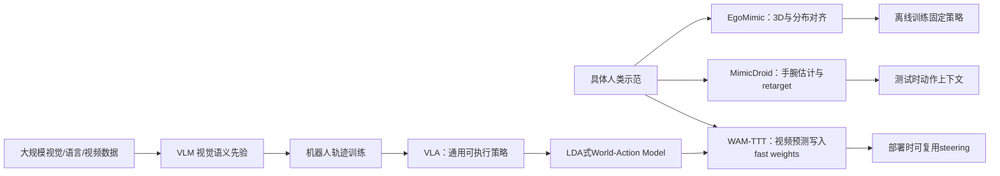
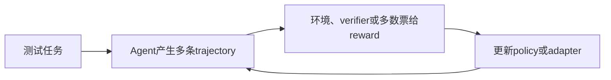

# WAM-TTT：从 VLA、人类视频模仿到部署时技能记忆

> Yusen Feng 等 · 2026 · *arXiv*
> [论文](https://arxiv.org/abs/2607.06988) · [HTML 全文](https://arxiv.org/html/2607.06988) · [LDA-1B](https://arxiv.org/abs/2602.12215)

## TL;DR

WAM-TTT 最大的创新不是“第一次用人类视频训练机器人”，也不是“让 VLM 看更长的视频”，而是把问题重新定义为：**在部署现场，如何用一小批无动作标注的人类第一视角视频，快速改变一个已经具备动作能力的 World-Action Model（WAM）**。

它通过一次 test-time gradient update，把人类视频压缩进 video expert 内部的 fast-weight memory；随后固定这份记忆，重复指导机器人 rollout，不必再次携带完整视频上下文。部署阶段不需要人手姿态、retarget、机器人动作或全模型 fine-tune，但人机对齐并没有消失，而是提前发生在 2,286 对人类—机器人 episode 的元训练阶段。

论文的主实验也不是“从一段视频学会完全新任务”。九个任务技能族已经出现在元训练中；主表所谓 New household 场景虽然没有机器人训练轨迹，但人类侧元训练视频已经在这些家庭环境采集，部署时又会在目标场景重录人类视频。因此更准确的能力描述是：**把已掌握技能迁移到机器人没去过、但人类侧已经提供过视觉证据的场景，并根据一段新的现场演示进行任务变体和用户偏好 steering。**

## Problem：四条路线的不同出发点

VLA、EgoMimic、MimicDroid 和 WAM-TTT 都可能使用人类视觉数据，但它们回答的不是同一个问题。

| 路线 | 最初的问题 | 人类视频扮演的角色 | 动作从哪里来 | 最终产物 |
|---|---|---|---|---|
| VLM → VLA | 如何把互联网视觉语言先验变成通用机器人策略 | 通用语义、物体、场景和部分时序先验 | 大规模机器人轨迹监督 action head | 一个可直接输出动作的基础策略 |
| EgoMimic | 机器人示范太贵，如何用人类数据扩充 imitation learning | 经过 3D 手部跟踪、坐标和分布对齐的训练样本 | 人手轨迹和机器人动作共同训练 | 吸收人类数据后的固定策略 |
| MimicDroid | 没有机器人训练数据，如何通过几个人类示例完成新组合任务 | 经过手腕估计、retarget 和 IK 的 observation-action context | 人类视频中恢复出的伪动作 | 每次执行都读取 context 的 ICL 策略 |
| WAM-TTT | 已有 WAM 如何在部署时被一段具体的人类示范快速 steering | 无人侧动作标注的视频预测样本和临时技能记忆 | 已训练好的 robot action expert | 可重置、可复用的 fast-weight memory |

### VLA 的起点：让视觉语言模型直接产生机器人动作

传统 VLA 的核心问题是：能否继承 VLM 的视觉语言能力，再用机器人 trajectory 把模型 grounding 到可执行动作。以 OpenVLA 为例，它把 action 离散成语言模型 vocabulary 中的 token，用约 97 万条真实机器人示范训练从图像和语言到动作的映射。

VLM 确实可以在预训练阶段观看大量人类视频，并且不需要 action model。但这只证明它能学习语义、物体、场景和部分时序常识，不代表某一段具体的人类示范能在部署时改变机器人动作。控制系统最终仍需要完成：

\[
\text{human visual knowledge}
\rightarrow
\text{robot-executable action}
\]

这一步通常由后续机器人行为克隆完成。因此，“VLM 预训练不需要动作对齐”是对的；“整个机器人系统不需要动作 grounding”是不对的。

普通 VLM 的训练目标还可能把控制细节压缩掉。多段不同的抓取方向、腕部姿态和接触过程，都可以对应同一句 caption“把杯子放到水槽”。这种表示具有 semantic sufficiency，却未必具有 control sufficiency。

### EgoMimic 的起点：减少昂贵的机器人数据

[EgoMimic](https://arxiv.org/abs/2410.24221) 不是部署时学习，而是 training-time data scaling。它使用 Project Aria 获取第一视角 RGB、SLAM 和 3D 手部位姿，并通过相机中心坐标、动作分布归一化、手/机械臂 mask 和运动方向 overlay，缩小人类与机器人之间的差异。人类数据与机器人数据共同训练 ACT 风格策略，最后形成固定权重。

它回答的是“人类一小时可以提供远多于机器人遥操作的数据，怎样把这些数据用于离线策略训练”，而不是“用户到现场拍一段视频，机器人马上改变行为”。

### MimicDroid 的起点：不用机器人训练数据，通过示例临时指定任务

[MimicDroid](https://arxiv.org/abs/2509.09769) 把问题推进到 test-time in-context learning。它训练时只收集人类 play video，但模型看到的并不是纯 RGB：WiLoR 先估计手腕 6DoF 和 grasp，再 retarget 到 humanoid wrist，并通过 IK 形成 action representation。context 中包含 observation-action pair，Transformer 根据示例预测当前动作。

它消除了机器人训练轨迹，却没有消除动作恢复与 embodiment conversion；同时每次控制都要携带示范 token。上下文示例增加到一定数量后会饱和或下降，计算、显存和噪声示例干扰都是瓶颈。

### LDA/WAM 的起点：用共享动态把视频和动作放进同一个模型

[UWM](https://arxiv.org/abs/2504.02792) 和 [LDA-1B](https://arxiv.org/abs/2602.12215) 提供了 WAM-TTT 成立的结构前提：video prediction 和 action diffusion 位于同一个多模态 Transformer 中。无动作视频可以监督世界动态，机器人轨迹则把动态表示 grounding 到可执行动作。

这比“VLM 后面单独接一个 action head”更适合 deployment-time video adaptation，因为 video expert 的变化能够通过 joint attention 进入 action expert。普通 VLM 即使会理解视频，也缺少一个已经校准好的接口，保证“人类视频上的自监督更新”一定改善机器人控制。

## Method：三项 contribution 应该怎样解读

论文给出的三项贡献分别对应问题定义、机制和实验结果，不能都归结为“用了人类视频”。

### 把 human-video steering 重新定义为 test-time training

第一项贡献是问题定义：不把人类视频只当作预训练数据、离线 imitation data 或推理 context，而把它当作部署现场的自监督适应信号。

“Raw human demonstrations”在这里表示人侧数据契约只需要第一视角 RGB，不需要：

- 人手 3D pose；
- MANO、关节角或接触标签；
- 人到机器人的 retarget；
- 机器人 deployment demonstration。

但 raw 不代表像素未经编码，也不代表系统没有预先建立人机对应关系。视频仍然经过 VLM/WAM 编码，人机对应关系则由元训练建立。

### 用 fast-weight TTT memory 吸收视频，同时冻结部署策略

每个 LDA diffusion block 包含 video expert 和 action expert，两者通过 joint attention 交流。WAM-TTT 只在 video expert 上增加 residual fast-weight branch：

\[
\Delta z = \theta_O f_W(\theta_Q z)
\]

其中慢投影参数保持冻结，只有小型 fast MLP 在部署时更新。人类视频一方面通过未来视频预测驱动更新，另一方面通过 Key-Value Memory reconstruction 使 fast MLP 学会近似人类视频的 K/V cache：

\[
f_W(K_h) \approx V_h
\]

元训练的内循环在无动作人类视频上写 memory；外循环在配对机器人轨迹上计算视频和动作损失，并反向穿过内循环。真正让 memory 对控制有用的不是视频预测本身，而是外层 robot action loss 学会了“机器人 query 应该怎样读取人类 K/V”。

这意味着人机对齐没有消失，而是从显式几何管线转移为 paired meta-learning：

\[
\text{显式 pose/retarget alignment}
\quad\rightarrow\quad
\text{隐式 learned query-key-value alignment}
\]

### 高效和可复用的准确含义

论文测试时只做一次 inner SGD iteration，学习率为 0.01；WAM、action expert、慢投影和 memory initialization 都冻结。适应完成后 fast weights 在 rollout 中保持固定，因此同一份示范可以支持多次执行，不必像 ICL 一样每个控制周期重新读取长视频。

不过，“一次梯度迭代”不等于“一秒完成”。论文只写输入是 a small batch / small set of human videos，没有报告：

- human clip 的明确数量和总时长；
- 录制到动作开始的端到端耗时；
- 一次 full WAM forward/backward 的墙钟时间；
- 测试适应所需 GPU、显存峰值和现场硬件。

因此目前可以说“参数更新范围小、只有一步、无需全模型 fine-tune”，不能据此宣传“用户拍完视频后几秒钟就能执行”。

## Results：论文真正证明了什么

主实验覆盖 Unitree G1、Galbot gripper 和 Galbot sharpa 三种 embodiment、九个操作任务。New household 平均 progress 中，WAM-TTT 为 46.2，原始 LDA 为 32.5，WAM-ICL 为 7.1。

这支持三点：

- 部署时人类视频确实能给基础 WAM 带来增益；
- fast-weight memory 在该实验设置下明显优于把相同视频直接放进 context；
- 冻结 action prior、只改 video-side memory 可以在一定程度上保留泛化。

但它没有证明 WAM-TTT 已经能从一段视频学习任意新技能。

### 任务不是全新的

元训练数据本身覆盖同样的九个任务。论文也承认，部署任务偏离元训练人机配对分布越远，适应效果越弱，而且尚未实证刻画边界。因此主结果更接近 seen skill family 下的 task variant steering。

### New household 不是对整个系统完全未见

机器人训练数据来自标准 cubicle，因此机器人确实没有在 New household 执行过。但论文附录明确说明，人类侧的元训练示范就在后来用于 New 评测的真实家庭环境中采集；测试时又会在部署场景重新录制人类视频。

所以“New”主要是相对于 robot trajectory domain 的新环境，不是相对于整个人类—机器人元训练系统的全新环境。论文另有“未见实验室、无现场人类视频”的直接迁移展示，但只有定性 rollout，没有主表同等级的定量结果。

### 部署不一定只需要一个视频

产品语言可以概括成“用户拍一段视频”，但论文使用的是 small batch / small set，未给出严格的 one-shot 数量。现有证据支持“少量无标注人类视频”，不支持把要求收窄成“恰好一个 clip”。

### 无标注不等于无先验成本

测试时确实无需人侧标签，但此前需要：

- LDA/WAM 预训练；
- 2,286 对人类—机器人 episode；
- 100k step 元训练；
- 8 张 NVIDIA H800；
- 针对相同技能族的人机 phase pairing。

论文的正确产品表述应该是：**重训练、重对齐成本由模型提供方提前承担，现场用户只承担拍摄少量第一视角 RGB 视频的成本。**

## TTT 的历史谱系：视觉适应、LLM 记忆与 Agent 学习

“Test-Time Training”在不同领域其实有两条历史传统。第一条把测试数据当作无标签适应数据，目标是抵抗 distribution shift；第二条把梯度更新设计成模型内部的状态转移，目标是用参数承载长上下文记忆。WAM-TTT 同时借用了两条路线。

| 路线 | 测试时更新什么 | 学习信号 | 记住什么 | 主要目标 |
|---|---|---|---|---|
| Dynamic Evaluation | 语言模型部分或全部参数 | 最近 token 的 next-token loss | 当前文档的局部词法和主题规律 | 降低后续 token perplexity |
| 经典视觉 TTT | 共享视觉 encoder | rotation 等自监督 auxiliary loss | 当前测试分布的视觉统计 | 抵抗 corruption/domain shift |
| Tent | normalization 统计和 affine 参数 | prediction entropy | 当前 batch 的分布统计 | source-free test-time adaptation |
| TTT-Linear / TTT-MLP | 每层线性模型或 MLP hidden state | token reconstruction/self-supervision | 长序列中的 key-value 关系 | 用固定大小参数记忆替代长 KV cache |
| Titans / Spatial-TTT | 独立 neural memory / spatial fast weights | surprise、重建或空间自监督 | 长文档事件或长视频空间证据 | 长期、流式记忆 |
| Agent Reflexion / episodic memory | 不更新模型参数，只更新文本 memory | 环境反馈和自我反思 | 失败原因、策略提示 | 下一次 rollout 少犯错 |
| Agent TTRL | LLM policy 参数或 adapter | majority vote、verifier、reward | 某批测试问题上的推理策略 | 在无标签测试集上继续 RL |
| WAM-TTT | video expert 内的 fast-weight branch | 人类视频预测 + K/V reconstruction | 当前场景、任务阶段和用户示范 | 让冻结 WAM 的动作策略被现场视频 steering |

### 早期 LLM：Dynamic Evaluation 是最直接的祖先之一

[Dynamic Evaluation of Neural Sequence Models](https://arxiv.org/abs/1709.07432) 在 2017 年就提出：语言模型读完一段近期文本后，用 next-token loss 做梯度下降，使参数适应当前作者、主题和重复模式，再预测后续 token。

其循环是：

这已经具有 TTT 的基本形态：测试输入同时是推理对象和训练数据。但它更新的是通用模型参数，容易遗忘，且每个文档都要控制学习率、衰减和 reset。

WAM-TTT 与它相似的地方是都利用输入自身提供的自监督目标；区别是 WAM-TTT 不更新基础 WAM，只更新预留的 fast memory，而且它需要元训练保证视频更新能够服务于机器人动作。

### 经典视觉 TTT：为每个测试样本临时校正 encoder

[Test-Time Training with Self-Supervision](https://arxiv.org/abs/1909.13231) 在 2020 年正式建立 TTT 范式。典型架构包括：

- 一个共享视觉 encoder；
- 一个主任务分类 head；
- 一个自监督 auxiliary head，例如预测图像旋转角度。

训练阶段同时优化分类和自监督任务。测试时先对当前无标签图像计算 rotation loss，更新共享 encoder，再进行分类：

\[
\theta'_x = \theta - \eta \nabla_\theta L_{aux}(x)
\]

\[
\hat y = g_{\theta'_x}(x)
\]

它的核心假设是：如果 auxiliary task 和主任务共享有用表示，那么让模型更适合当前图像的自监督结构，也会让分类更准确。

WAM-TTT 的 human video prediction 对应这里的 auxiliary task；robot action generation 对应主任务。但 WAM-TTT 多了一层关键的 meta-alignment，因为“更会预测人类视频”并不天然等于“机器人动作更好”。外层 robot loss 专门学习这两个目标之间的因果接口。

### Tent：没有辅助任务，直接最小化预测熵

[Tent](https://arxiv.org/abs/2006.10726) 是 test-time adaptation 的另一条代表路线。它不构造 rotation head，而是认为模型在目标域应该给出更确定的预测，因此最小化输出 entropy，只更新 batch normalization 的统计量和 channel-wise affine 参数。

它比经典 TTT 更轻，但也更容易出现 confirmation bias：如果模型一开始就自信地预测错了，最小化熵可能让错误更加坚定。

WAM-TTT 没有使用 action entropy 或动作伪标签，正是为了避免让机器人用自己的错误动作判断继续强化自己。它选择在人类视频侧使用可验证的 future-video reconstruction 信号。

### TTT layer：把“训练”变成神经网络的隐藏状态更新

[Learning to (Learn at Test Time): RNNs with Expressive Hidden States](https://arxiv.org/abs/2407.04620) 把 TTT 从部署适应方法改造成一种基础 sequence architecture。

传统 RNN 的状态是向量：

\[
h_t = F(h_{t-1},x_t)
\]

TTT layer 的状态则是一个小模型的参数：

\[
W_t = W_{t-1} - \eta \nabla_W L_{self}(W_{t-1};x_t)
\]

当前 token 通过自监督训练写入 (W_t)，后续 token 把它当作 memory 查询。论文实现了：

- TTT-Linear：hidden state 是线性模型；
- TTT-MLP：hidden state 是两层 MLP。

这条路线不是为了适应一个新 domain，而是为了把长序列压缩到固定大小、可训练的 hidden state 中。它可以理解为：

> Transformer 把历史保存在显式 KV cache；TTT layer 把历史编译进参数。

WAM-TTT 的 K/V reconstruction 和 fast MLP 主要继承这条路线。其附录也说明，在线性特殊情况下，fast-weight update 可以近似一类 linear attention。不同之处在于，LLM TTT layer 通常逐 token 连续更新，而 WAM-TTT 在机器人 rollout 前用一小批人类视频更新一次，执行过程中保持固定。

### Titans 与 Spatial-TTT：从语言长期记忆走向空间视频记忆

[Titans](https://arxiv.org/abs/2501.00663) 延续“neural memory 在测试时学习”的思想，把短期 attention 与长期参数记忆组合起来，重点记住对当前模型而言更 surprising 的事件。

[Spatial-TTT](https://arxiv.org/abs/2603.12255) 则把 fast-weight memory 用到长视频空间理解。它通过大块更新和滑动窗口 attention，把持续到来的视觉证据写进参数，避免把无限视频帧全部保存在上下文中。

WAM-TTT 的 memory architecture 与 Spatial-TTT 最接近，但增加了一个机器人独有问题：空间或视频记忆怎样跨 embodiment 变成可执行 action。因此它必须加入人类 K/V、机器人 Query 和外层 robot action loss。

### Agent 领域：多数“测试时学习”严格来说不是 TTT

Agent 文献里常把以下方法都称为 test-time learning：

- 多采样几条 reasoning/trajectory，再由 verifier 选择；
- ReAct 式思考—行动循环；
- RAG 和 episodic memory；
- 根据失败写一段 reflection，下一次放回 prompt；
- 搜索、规划、辩论和多 Agent 投票。

这些方法提高了 test-time compute，但模型参数没有变化，严格来说不是 TTT。[Reflexion](https://arxiv.org/abs/2303.11366) 就明确强调“不更新权重”，而是把语言反思写入 episodic memory buffer。

它们和 WAM-TTT 的共同点是都在基础模型之外保存经验；区别在于 Reflexion 保存的是显式文本，WAM-TTT 保存的是由梯度写入的隐式视觉参数记忆。

### 真正的 Agent TTT：用测试轨迹继续训练 policy

[TTRL: Test-Time Reinforcement Learning](https://arxiv.org/abs/2504.16084) 才属于严格的参数更新路线。它在没有标准答案的测试问题上采样多条 reasoning，通过 majority voting 等方式构造伪 reward，再用 RL 更新模型。

典型 Agent TTRL 循环是：

它能够发现原模型没有稳定掌握的推理策略，但代价是：

- 必须先执行或采样，才能得到反馈；
- 计算开销远高于一次前向推理；
- 伪 reward 可能导致 reward hacking；
- 更新 policy 本身，存在灾难性遗忘和安全风险。

WAM-TTT 则是 demonstration-driven TTT：机器人执行前先观看人类示范，用视频预测写 memory，不需要机器人试错和环境 reward，也不更新 action policy。这使它更适合物理世界，因为真实机器人失败一次可能破坏物体或伤人；相应代价是它只能吸收示范中可见的信息，不能像 RL 一样通过探索发现隐藏动力学。

### WAM-TTT 在整个 TTT 谱系里的准确位置

WAM-TTT 可以写成四种思想的组合：

\[
\text{WAM-TTT}
=
\text{经典自监督 TTT}
+
\text{TTT-layer 参数记忆}
+
\text{MAML 式人机元对齐}
+
\text{LDA video-action coupling}
\]

| 对比点 | 经典视觉 TTT | LLM TTT layer | Agent TTRL | WAM-TTT |
|---|---|---|---|---|
| 主要问题 | 测试分布偏移 | 长上下文记忆 | 测试任务上继续学策略 | 人类视频部署期 steering |
| 测试信号 | 单张图像自监督 | 当前 token 自监督 | rollout reward / verifier | 人类未来视频预测 |
| 更新范围 | 共享 encoder | 每层 fast state | policy / adapter | video-side fast memory |
| 是否更新主策略 | 通常会间接更新 | 它本身就是序列层 | 会 | 不更新 action expert |
| 是否需要环境交互 | 否 | 否 | 通常需要采样/反馈 | 否，只需要人类视频 |
| 是否需要元训练 | 不一定 | 需要 outer-loop 学写入规则 | 不一定 | 强依赖人机配对元训练 |
| 最大风险 | 错误自监督导致漂移 | 容量覆盖、长程遗忘 | reward hacking、策略退化 | 错误示范写入、跨 embodiment 失配 |

因此它最特别的地方不是用了梯度更新，而是把测试时梯度更新限制在一个提前校准的“adaptation seat”中：写入信号来自安全的人类观察，读取者是机器人视觉 query，动作先验保持冻结。

## My Notes

我认为这篇论文最大的创新，确实是把人类视频从“预训练语料”变成了“部署接口”。它提出了一种很有产品感的交互方式：

> 展示一次 → 编译成临时 skill memory → 重复执行。

这比“VLM 看过很多人类视频”更进一步。大规模 VLM 预训练解决的是通用先验，WAM-TTT 解决的是某个用户、某个场景、某个任务变体怎样在部署现场进入控制系统。

但目前更准确的能力定位不是“纯人类视频零样本教会机器人新技能”，而是：

> 一个已经预训练、已经拥有机器人动作能力、并在人机配对数据上见过该技能族的 WAM，如何用现场无标注视频快速恢复或调整技能。

可以把论文的创新强度分成三层：

| 层次 | 判断 |
|---|---|
| 交互范式 | 强：首次把 action-free human-video steering 系统化为 WAM 的 TTT 接口 |
| 架构机制 | 强：fast-weight K/V memory 与 robot outer loss 的组合形成可复用控制记忆 |
| 泛化结论 | 中等：证明了任务变体和机器人未见环境迁移，尚未证明任意新技能、完全新场景或真正 one-video learning |

如果将它产品化，下一步最应该补的不是更大的平均分，而是四条工程曲线：

1. 视频数量与总时长 → 成功率；
2. 录制结束 → 可执行的墙钟延迟；
3. 任务与元训练分布距离 → 适应增益或负迁移；
4. memory 连续写入多个用户、任务和场景后的容量、覆盖与 reset 策略。

Stamp Paper 上 WAM-TTT 低于原始 LDA，也提醒了一点：fast memory 是可写控制接口，同时也是新的风险入口。真正部署时需要 memory version、reset、适应前后验证以及回退到基础策略的机制。

## Related

- [[kimOpenVLAOpenSourceVisionLanguageAction2024a]]
- [Unified World Models](https://arxiv.org/abs/2504.02792)
- [LDA-1B](https://arxiv.org/abs/2602.12215)
- [EgoMimic](https://arxiv.org/abs/2410.24221)
- [MimicDroid](https://arxiv.org/abs/2509.09769)
