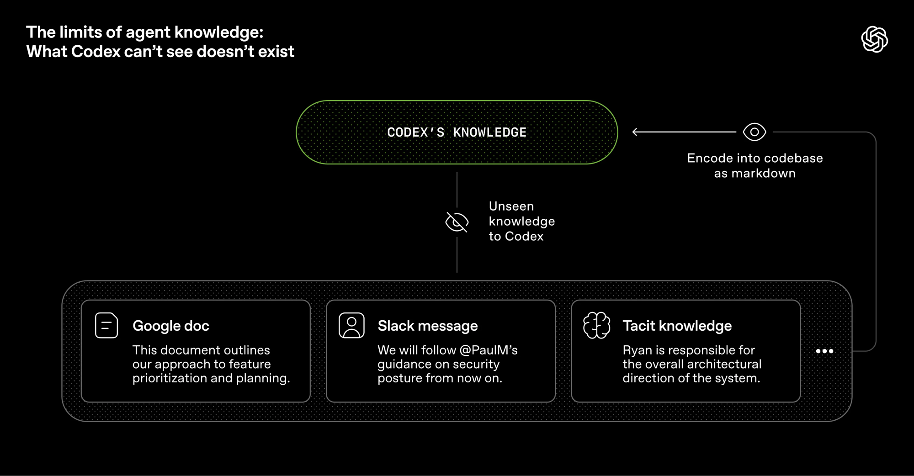
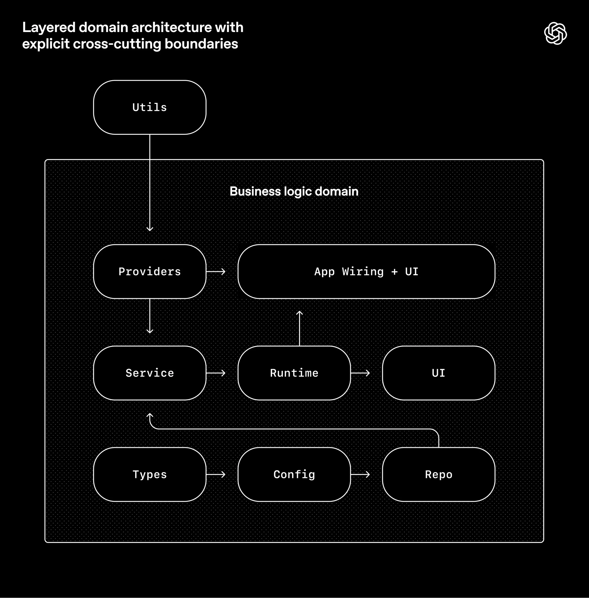
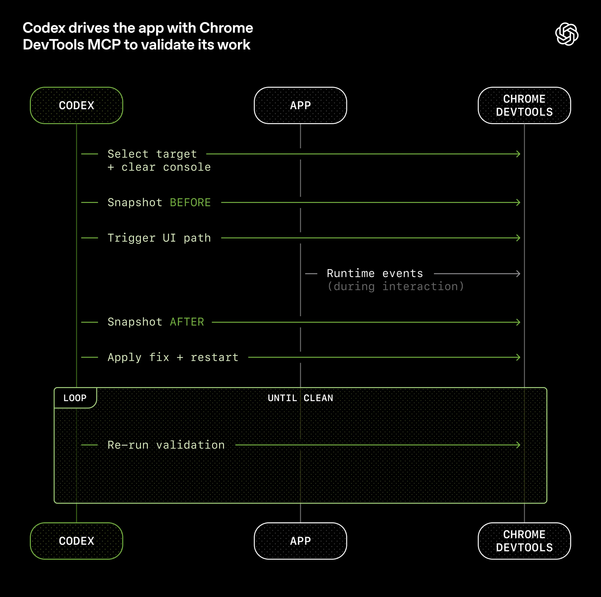
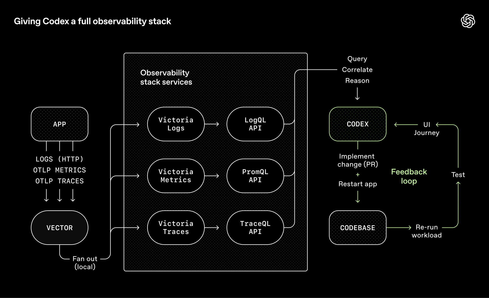

# Harness Engineering: 搭建 AI-Native Infra 的思考

本文主要参考 OpenAI 的博客 [Harness engineering: leveraging Codex in an agent-first world](https://openai.com/index/harness-engineering/)。

**AI-Native Infra 的含义：**

1. **ai-native** 指的是把项目中各个同学的标准化工作流用 AI 自动迭代开发，而不是每个人各搞各的。
2. **infra** 指的是在产品开发、测试、展示和项目落地等流程中提供**统一的基础架构**，而非个人配置个人的 skills、agents。

对于 AI-Native 的项目，我们多数时候是面向 markdown 编程——本质上是维护好 markdown 文件的层级关系。

<!-- more -->

## 行业观察

2026 Q1，几个标志性事件集中发生：

- **OpenAI**：3 人团队，5 个月，0 行手写代码，Codex 交付百万行代码产品，人均日产 3.5 PR。
- **Anthropic**：16 个 Claude 并行跑出 10 万行 Rust C 编译器，GCC torture test 通过 99%，能编译 Linux 内核。
- **OpenCLI**：[jackwener/opencli](https://github.com/jackwener/opencli) 用浏览器 DevTools 给各类应用套 CLI，供 Agent 调用。同类工具不少，但 OpenCLI 火在 ai-native 设计——稳定期后 contributor 一句话就能让 agent 适配新应用。

这几件事的共性不是「模型变强了」，而是**它们都在基础设施上做了大量投入**。Can.ac 的实验更直接——同一模型只改工具格式（prompt 和权重不动），Grok Code Fast 1 编码分从 6.7% 到 68.3%。说明真正的杠杆不在模型侧，在环境侧。

业界给这套方法论起了个名字：Harness Engineering。那么接下来的问题就是——为什么之前的方法论不够用了？

## 为什么 Prompt Engineering 不够

过去两年大多数团队走的路是 Prompt Engineering：调 prompt、写 few-shot、做 chain-of-thought。单次对话场景下有效，但四个结构性局限：不可迁移（换模型就得重调）、不可组合（对话间经验无法积累）、不可验证（只能人肉看）、不可扩展（Agent 连续跑 6 小时时撑不住）。

Prompt Engineering 是优化单次对话的输入。当 Agent 成为团队的长期协作者，你需要优化的不是输入，而是**整个工作环境**。

这就是 Harness Engineering 的出发点。

## Harness Engineering 在解决什么

**模型是 CPU，Harness 是操作系统。** CPU 算力再强，没有 OS 调度资源、管理权限、提供反馈，什么都跑不起来。

Harness 要回答三个问题：

1. Agent 在哪干活？——文件系统、沙箱、可观测性工具
2. Agent 用什么干活？——工具链、API、Linter、CI
3. Agent 怎么知道自己干得对不对？——测试、反馈回路、验收标准

理解了这三个问题，就能看清 Harness Engineering 和已有方法论的关系。

### 跟 SDD / TDD 是什么关系

SDD（规范驱动开发）和 TDD（测试驱动开发）并不过时，它们分别覆盖了上面三个问题中的一部分：

- **SDD → 上下文层**。规范定义「Agent 该做什么」，对应 `product-specs/`、`design-docs/`、`exec-plans/`。
- **TDD → 反馈层的一环**。测试验证「做对了没」，但只是 Gate Chain 中的一道关卡，还需要 Linter、import 边界检查、Golden Output 比对等其他 Gate。

| | SDD | TDD | Harness Engineering |
|---|---|---|---|
| 关注点 | 做什么 | 做对没 | 整个工作环境 |
| 覆盖 | 规范/契约 | 测试 | 上下文 + 约束 + 反馈 + 熵管理 |
| 执行 | 人的自觉 | 人的自觉 | 机器强制 |

关键差异在最后一行。传统开发中 SDD 和 TDD 靠自觉，Agent 开发中必须沉淀为基础设施。**从自觉到强制，这是 Harness 多出来的一层。**

理解了定位，下一步是选择什么工具形态来承载它。

## 一个判断：团队会从 CLI-first 走向 GUI-first

从今年开始，各家都开始上架 GUI 工具，gemini 推出了 antigravity 工具，openai 的 codex gui 体验变好。社区也推出了相应的闭源 alma gui。

OpenAI 用 Codex（GUI）而非纯 CLI，核心原因是GUI对历史多会话的进度监控优于纯 GLI。

理由： cli 工具当前通过 git worktree 来支撑项目的并行开发。
> **git worktree 并行**：每个 worktree 一个隔离特性分支，独立应用实例、日志、指标，完成即销毁。一个 Agent 在 worktree A 跑 6 小时修 bug，另一个同时在 B 做新功能。

当你同时管 5-10 个并行 Agent，CLI 不便于进行多窗口观察——这往往意味着项目需要全局视图监控进展、跨分支切换审查、协调冲突。GUI更便于监控和协调。因此CLI 更倾向于个人开发，GUI 更倾向于团队平台。

那 Harness 的基建具体怎么搭？OpenAI 在实践中摸索出了三层结构。

## 基建：三层架构

### 第一层：上下文层——仓库即事实源

OpenAI 最初把所有信息塞进一个大 AGENTS.md，很快走不通了：上下文用到 40% 性能就掉，全标「重要」等于没重点，单文件无法自动校验，腐烂很快。

解法：**AGENTS.md 只做索引（约 100 行），内容分发到 docs/**：

```
AGENTS.md
ARCHITECTURE.md
docs/
├── design-docs/
│   ├── index.md
│   ├── core-beliefs.md          ← agent-first 原则
│   └── ...
├── exec-plans/
│   ├── active/
│   ├── completed/
│   └── tech-debt-tracker.md
├── generated/
│   └── db-schema.md             ← 自动生成，与代码同步
├── product-specs/
│   ├── index.md
│   ├── new-user-onboarding.md
│   └── ...
├── references/
│   ├── design-system-reference-llms.txt
│   ├── uv-llms.txt             ← 第三方依赖的 LLM 友好文档
│   └── ...
├── DESIGN.md
├── FRONTEND.md
├── PLANS.md
├── PRODUCT_SENSE.md
├── QUALITY_SCORE.md             ← 按模块评分，追踪质量缺口
├── RELIABILITY.md
└── SECURITY.md
```

这就是前面说的「面向 markdown 编程」——团队的知识、规范、计划全部以 markdown 形式版本化管理在仓库里，Agent 进入项目时按层级结构读取，而不是依赖口头传递或外部文档。

两条原则：

**Agent 看不到的信息不存在。** Slack 讨论、Google Docs PRD、团队默契——不在仓库里，Agent 就感知不到。



**AGENTS.md 是持续更新的反馈循环。** Hashimoto 在 Ghostty 项目中，AGENTS.md 每一行对应一个 Agent 历史踩坑记录，每次出错就补进去。OpenAI 还跑了 doc-gardening Agent 定期清理过期内容——Agent 维护给 Agent 看的文档。

上下文层解决了「Agent 该看什么」。但光告诉它该看什么还不够——还得确保它按规矩来。

### 第二层：约束层——机械化执行

口头规范对 Agent 无效。**不能被机器拦截的规则，Agent 一定会违反。**

> "If it cannot be enforced mechanically, agents will deviate." — OpenAI

OpenAI 为每个业务域定义分层依赖方向，自定义 Linter + 结构测试自动拦截：



`Types → Config → Repo → Service → Runtime → UI`，横切关注点走 Providers 单一入口，其余依赖方向全部禁止。这种架构约束在人工团队里通常几百人规模才上，Agent 模式下是 Day 1 基础设施。

Linter 报错要写给 Agent 看——不只标违规，直接给修复方案。**工具在报错时同时教 Agent。**

约束层确保 Agent 按规矩来。但「按规矩来」和「做对了」是两回事——Agent 还需要手段验证自己的输出。

### 第三层：反馈层——Agent 自验证

Agent 自评不可信。给它工具，让它实际检查输出。

OpenAI 接入 Chrome DevTools Protocol，Agent 可截图、读 DOM、驱动 UI 交互验证：



每个 worktree 配完整可观测性栈——LogQL / PromQL / TraceQL，worktree 级临时环境，任务完成即销毁：



Anthropic 的方案更激进——**把生成和评估拆成两个 Agent**。生成器负责实现，评估器拿着工具（Puppeteer）实际操作输出：点按钮、填表单、截图、对照标准打分。两者来回迭代 5-15 轮。效果差异很大：单 Agent 跑 20 分钟花 9 美元，产出能看但不能用；完整 Harness 跑 6 小时花 200 美元，交付了一个可发布的完整应用。**投入大了 20 倍，但产出从 demo 变成了产品。**

基建成熟后 Agent 能端到端跑通特性闭环：复现 bug → 录视频 → 修复 → 验证 → 开 PR → 回复 review → 修 CI → 需要判断时才升级给人 → 合并。

三层搭完，还有一个问题：Agent 生成的代码会随时间积累熵。OpenAI 最初每周五花 20% 时间人工清理，后来把 golden principles 编码进仓库，后台 Agent 定期扫描偏差、提 PR、automerge——技术债持续小额偿还。

## 落地：整个工作流怎么运转

前面讲的是概念和分层，这里拉通看一下整个工作流在实际项目中是怎么跑起来的。

### 整体拓扑

```
HUMAN (Product Owner)
  │
  │  意图 / 约束 / 品味判断
  v
+─────────────────────────────────────────────────────+
│                 REPO = 唯一事实源                     │
│                                                     │
│  AGENTS.md ──> docs/ ──> src/ ──> config/ ──> tests/│
│  (索引)       (深层     (代码)   (行为      (证据)   │
│               文档)              配置)               │
+─────────────────────────────────────────────────────+
  │                    │                    │
  v                    v                    v
GATE CHAIN          业务引擎             自动化验证
(机械化约束)        (决策链路)           (反馈循环)
  │                    │                    │
  v                    v                    v
ALL PASS? ──no──> BLOCK ──> Agent 修复或人工审查
  │
 yes
  v
MERGE / DEPLOY
```

人负责输入意图和约束，Agent 在仓库这个「操作系统」里执行。所有产出必须经过 Gate Chain 才能合并——不是靠人盯，是靠机器拦。

### Gate Chain：一条命令跑完所有检查

这是约束层落地的核心。不是零散的 CI job，而是一条命令串联所有 Gate，任何一关不过就 BLOCK：

```
project-check  (一条命令，所有关卡)
════════════════════════════════════

Gate A: 格式 + Lint
┌──────────────────────────────────────────┐
│  ruff check src/ tests/ scripts/         │
│  ruff format --check src/ tests/         │
│                                          │
│  WHY: 文档会腐烂，Lint 规则不会。         │
│  COST: <2s                               │
└──────────────────────────────────────────┘
        │ pass
        v
Gate B: Import 边界
┌──────────────────────────────────────────┐
│  src/plugins/** 禁止 import:             │
│    src.domain.*  (只允许 protocols.py)    │
│    src.core.*                            │
│                                          │
│  WHY: 架构腐化就是熵增。                  │
│  COST: <1s (AST 扫描)                    │
└──────────────────────────────────────────┘
        │ pass
        v
Gate C: Golden Output
┌──────────────────────────────────────────┐
│  固定输入 + 默认参数                      │
│    → 跑 pipeline → 输出 JSON             │
│    → diff vs tests/golden/expected.json  │
│                                          │
│  任何差异 = 必须显式批准。                 │
│  WHY: "跑过一次"不是验证。                │
│  COST: ~3s                               │
└──────────────────────────────────────────┘
        │ pass
        v
Gate D: 双路径一致性
┌──────────────────────────────────────────┐
│  同一输入 → 旧路径 → 输出 A              │
│          → 新路径 → 输出 B               │
│  assert 一致（或声明差异）                │
│                                          │
│  WHY: 两条路径不能悄悄分叉。              │
│  COST: <1s                               │
└──────────────────────────────────────────┘
        │ pass
        v
Gate E: 完整测试套件
┌──────────────────────────────────────────┐
│  pytest --tb=short -q                    │
│                                          │
│  WHY: 要证据，不要感觉。                  │
│  COST: ~2s                               │
└──────────────────────────────────────────┘
        │
        v
ALL PASS? ──no──> BLOCK (Agent 修复或人工介入)
        │
       yes
        v
MERGE / DEPLOY
```

几个设计要点：

- **每个 Gate 都标注了 WHY 和 COST。** WHY 是给 Agent 和新人看的——为什么这道关卡存在。COST 是给团队决策用的——总耗时不到 10 秒，没有不跑的理由。
- **Gate B（Import 边界）是架构防线。** 不是文档约定，是 AST 扫描的硬约束。模块依赖方向写死了，违反就报错，报错信息直接告诉 Agent 怎么改。
- **Gate C（Golden Output）防止静默回归。** Agent 改了一行代码导致输出变了——必须显式批准，不能悄悄过。比单元测试更贴近业务真相。
- **Gate D（双路径一致性）** 在重构或迁移场景下非常关键。新旧两条路径喂同样的输入，输出必须一致，否则要么修要么声明差异。

### Module 边界：Gate B 背后的依赖规则

Gate B 不是随便扫的，背后是一张明确的模块依赖图：

```
src/
├── domain/        ← 地基层（不 import 任何内部模块）
│   └── *.py          纯 dataclass、enum、类型定义
│
├── infra/         ← 基础设施层（只 import domain）
│
├── plugins/       ← 插件层（只 import protocols.py）
│   ├── protocols.py   插件接口定义
│   ├── registry.py    插件注册
│   ├── handlers/      只 import protocols
│   └── adapters/      只 import protocols
│
├── core/          ← 业务核心（禁止 import app、execution）
│
├── execution/     ← 执行层（import domain、infra）
│
└── app/           ← 顶层（可以 import 所有）

禁止的依赖边（Gate B 检测这些）：
✗  plugins/*   → domain.*
✗  plugins/*   → core.*
✗  core/*      → app.*
✗  core/*      → execution.*
```

这张图的价值：Agent 在任何位置写代码，都有明确的 import 白名单和黑名单。违反了，Linter 直接拦，报错信息告诉它应该 import 什么。不是靠 Agent「理解」架构意图，是靠工具强制执行。

### 原则映射：从 OpenAI 理念到具体实现

最后把 OpenAI 博客中提到的原则和实际落地做一个对应：

| OpenAI 原则 | 落地实现 |
|---|---|
| 仓库即事实源 | AGENTS.md（索引）+ docs/（深层文档）+ config/（行为配置），不在聊天和文档工具里留隐性知识 |
| AGENTS.md 是地图不是手册 | 约 100 行入口文件，指向 ARCHITECTURE.md、DESIGN.md、各专项文档 |
| 机械化执行约束 | Gate A-E 串联，一条命令跑完，CI 挡住不合格提交 |
| Agent 可读性优先 | 纯数据结构（dataclass/frozen）、纯函数式插件、无 ORM 无框架魔法、显式事件总线 |
| 熵管理 | Golden Output 捕捉回归、Import 边界防漂移、定期清理 Agent 扫描低质量代码 |
| 吞吐优先的合并策略 | Pipeline 总耗时 <10s 支撑快速迭代，flaky test 用 follow-up 修而非 block |

## 落地优先级

**P0（起步门槛）**：

- [ ] 写 AGENTS.md 索引入口，Agent 犯错即更新
- [ ] 搭 docs/ 目录结构，团队知识沉淀到仓库而非 Slack/Docs
- [ ] 至少一条架构约束做成 Linter（建议从 import 边界开始）
- [ ] CI 跑通 Gate Chain，Agent 提交必须过关

**P1（效率杠杆）**：

- [ ] Golden Output 基线测试，端到端比对业务输出
- [ ] 双路径一致性检查（重构/迁移场景）
- [ ] 进度文件用 JSON 而非 Markdown（Agent 不易乱改结构化数据）
- [ ] Linter 报错信息重写——给 Agent 看，包含修复方案

**P2（规模化运行）**：

- [ ] 可观测性接入——Agent 可查询日志和指标
- [ ] 清理 Agent 定期跑，扫描文档过期和架构违规
- [ ] GUI 平台管理多 worktree 并行 Agent

一条原则贯穿始终：**Agent 出错，先审视 infra 缺什么。**

## 附：AGENTS.md 实例

附一个符合 Harness Engineering 思路的 AGENTS.md 骨架。它不是 prompt，而是仓库的**索引入口**——告诉 Agent 项目怎么跑、文档去哪找、什么规则不能违反：

```markdown
# AGENTS.md

## 项目概述
本项目是 XXX 服务的后端。技术栈：Python 3.12 + FastAPI + PostgreSQL。
部署环境：Docker on AWS ECS。

## 快速开始
- 启动开发环境：`make dev`
- 跑全部检查：`make check`（必须全部通过才能提 PR）
- 跑测试：`uv run pytest --tb=short -q`

## 文档索引（按需查阅，不要一次全读）
- 架构总览 → ARCHITECTURE.md
- 模块边界和依赖规则 → docs/MODULE_BOUNDARIES.md
- API 设计规范 → docs/API_DESIGN.md
- 当前迭代计划 → docs/exec-plans/active/
- 已完成的决策记录 → docs/design-docs/
- 第三方依赖用法 → docs/references/

## 架构约束（违反会被 CI 拦截）
- 依赖方向：domain → service → api → app，禁止反向
- plugins/ 只能 import protocols.py，不能直接依赖 domain
- 所有 API 入参必须用 Pydantic model 校验，禁止裸 dict
- 日志必须结构化（structlog），禁止 print / logging.info 裸字符串

## 工作方式
- 改完代码先跑 `make check`，不要等 CI 告诉你
- 改了业务逻辑要检查 tests/golden/ 下的基线是否需要更新
- 不确定的架构决策写 docs/design-docs/ 下的 ADR，不要在代码注释里讨论
- 遇到需要人类判断的问题，停下来说明情况，不要猜
```

这份文件的核心：**不教 Agent 怎么写代码，而是告诉它项目怎么运转、规则在哪、文档去哪找。** 保持短（100 行以内），指向深层文档，每次 Agent 犯错就补一条。

---

> 瓶颈不在智能，而在基础设施。
